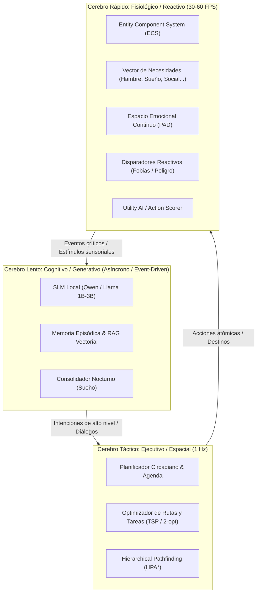

# Sentient NPC Architecture (SNA)
### Arquitectura de Agentes Autónomos con Cognición Híbrida, Simulación Sistémica y LOD Conductual

> **Sentient NPC Architecture (SNA)** es un marco de diseño técnico para videojuegos de mundo abierto, simuladores de vida y RPGs que busca cerrar la brecha entre la **simulación sistémica profunda** (*RimWorld, The Sims, Red Dead Redemption 2*) y los **agentes generativos basados en modelos de lenguaje** (*Smallville, Project Sid*), garantizando **alta eficiencia en CPU/GPU** para operar cientos de personajes de forma simultánea.

---

## 🧭 Visión y Filosofía de Diseño

Los videojuegos actuales se dividen en dos paradigmas disjuntos:
1. **Mundos vivos pero mudos:** Juegos como *RimWorld*, *Dwarf Fortress* o *The Sims 4* tienen simulaciones sociales y necesidades increíbles, pero sus interacciones son mecánicas, con árboles de texto rígidos o iconos abstractos.
2. **"Chatbots con piernas":** Demos técnicas y juegos conversacionales basados en LLMs (*Vaudeville, Inworld*) donde puedes hablar libremente, pero el mundo físico no existe: el NPC no tiene hambre real, no trabaja el campo ni tiene una rutina que seguir si el jugador no le habla.

**SNA propone un tercer paradigma:**
> **La física, las necesidades y el drama social gobiernan la simulación matemática a 60 FPS; el Modelo de Lenguaje (SLM/LLM) actúa como la voz, la memoria reflexiva y el traductor de intenciones a bajo coste.**

---

## 🏛️ Arquitectura General: El Modelo del "Cerebro Triuno"

---

## 📚 Índice de Documentación de Diseño

La especificación completa del sistema está dividida en los siguientes documentos técnicos dentro del directorio [`docs/`](docs/):

| Documento | Enfoque Principal |
| :--- | :--- |
| **[01. Visión y Arquitectura de Sistemas](docs/01-system-architecture.md)** | Desglose del "Cerebro Triuno", ciclo de vida por ticks, bucle principal desacoplado y gestión de hilos. |
| **[02. Modelo de Personaje y Psicología](docs/02-psychology-and-character-model.md)** | Personalidad OCEAN (Big Five), vectores de necesidades fisiológicas, espacio emocional PAD, fobias, filias y anclas biográficas. |
| **[03. Grafo Social Dinámico y Motor de Drama](docs/03-social-graph-and-drama-engine.md)** | Grafo relacional asimétrico (afinidad, confianza, atracción), propagación memética de rumores, matrimonios, traiciones e infidelidades. |
| **[04. Inteligencia Espacial, Rutinas y TSP](docs/04-spatial-ai-and-routines.md)** | Grafos de Puntos de Interés (POI), resolución ligera del Problema del Viajante (TSP / 2-opt) para recados diarios y navegación HPA*. |
| **[05. Pipeline de Memoria y Cognición](docs/05-memory-and-cognitive-pipeline.md)** | Búfer sensorial en anillo, almacenamiento semántico ligero, función de puntuación de recuperación (*Retrieval Score*) y consolidación en el sueño. |
| **[06. Rendimiento, LOD Conductual y Hardware](docs/06-hardware-and-performance-lod.md)** | Estratificación en LOD 0, 1 y 2, planificación de inferencia con *time-slicing*, integración de SLMs locales cuantizados (GGUF / ONNX DirectML). |
| **[07. Prototipo 2D: Aldea Mínima Viable (MVP)](docs/07-mvp-village-implementation-plan.md)** | Plan de desarrollo para simulación 2D de 5 personajes con mapa, drama emergente, desglose de tareas y estimaciones de tiempo. |

---

## ⚡ Principios de Rendimiento y Escalabilidad

1. **CPU First para Matemáticas:** El 99.9% de las decisiones (caminar, comer, huir de un lobo, bostezar) se calculan mediante operaciones matriciales y enteros en CPU usando **ECS y Utility AI**, consumiendo menos de 0.05 ms por NPC.
2. **Behavioral LOD (Nivel de Detalle de IA):**
   * **LOD 0 (< 20m del jugador):** Modelo visual completo, diálogos generativos en tiempo real, micro-expresiones.
   * **LOD 1 (20m - 100m):** Rutinas activas con NavMesh simplificado, diálogos pre-calculados o esquemáticos.
   * **LOD 2 (> 100m / Ciudad entera):** Simulación estadística y matemática pura. No hay mallas 3D ni colisiones; el NPC se desplaza como un puntero temporal sobre su agenda.
3. **Desacoplamiento Asíncrono del LLM:** El motor de juego **nunca espera** una respuesta del modelo de lenguaje. Las peticiones entran a una cola de prioridad atendida por un hilo secundario en segundo plano.
4. **SLMs Locales Cuantizados:** Diseñado para operar sobre modelos pequeños ultra-optimizados (0.5B a 3B parámetros como Qwen 2.5 o Llama 3.2 en 4-bits) ejecutados mediante NPU, DirectML o CPU AVX2, sin depender de servidores en la nube ni pagar por llamadas a API.
