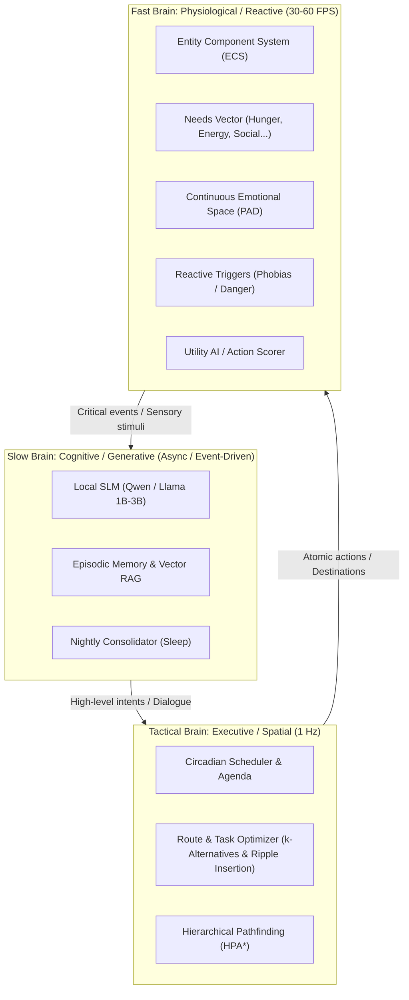

# Sentient NPC Architecture (SNA)
### Autonomous Agent Architecture with Hybrid Cognition, Systemic Simulation, and Behavioral LOD

> **Sentient NPC Architecture (SNA)** is a technical design framework for open-world games, life simulators, and RPGs aimed at bridging the gap between **deep systemic simulation** (*RimWorld, The Sims, Red Dead Redemption 2*) and **generative language model agents** (*Smallville, Project Sid*), ensuring **high CPU/GPU efficiency** to operate hundreds of characters simultaneously.

---

<p align="center">
  
  <br>
  <em><b>Visual Concept Mockup:</b> Target design for the 2D Village Prototype (MVP), illustrating systemic routines, real-time generative dialogue barks, and live psychological telemetry inspection (Needs, PAD space).<br><sub>⚠️ Note: Illustrative design mockup, not an in-engine screenshot.</sub></em>
</p>

---

## 🧭 Vision & Design Philosophy

Modern video games are largely split into two disjoint paradigms:
1. **Living yet silent worlds:** Games like *RimWorld*, *Dwarf Fortress*, or *The Sims 4* boast remarkable social simulation and biological needs, but interactions remain mechanical, bound to rigid dialogue trees or abstract floating icons.
2. **"Chatbots with legs":** Tech demos and LLM-based conversational titles (*Vaudeville, Inworld*) where players can converse freely, but physical grounding is absent: NPCs have no genuine hunger, don't farm fields, and possess no living routine if the player is not actively speaking with them.

**SNA proposes a third paradigm:**
> **Physics, biological needs, and social drama govern the mathematical simulation at 60 FPS; the Small Language Model (SLM/LLM) acts as the voice, reflective memory, and low-cost intent translator.**

---

## 🏛️ General Architecture: The "Triune Brain" Model



---

## 📚 Design Documentation Index

The complete architectural specification is organized into dedicated technical documents inside the [`docs/`](docs/) directory:

| Document | Primary Focus |
| :--- | :--- |
| **[01. System Architecture & Vision](docs/01-system-architecture.md)** | Breakdown of the "Triune Brain", tick life-cycles, decoupled main loop, and multi-threaded execution model. |
| **[02. Character Model & Psychology](docs/02-psychology-and-character-model.md)** | OCEAN personality traits (Big Five), physiological needs vectors, continuous PAD emotional space, phobias, philias, and biographical lore anchors. |
| **[03. Dynamic Social Graph & Drama Engine](docs/03-social-graph-and-drama-engine.md)** | Asymmetric relational graphs (affinity, trust, romance, dominance), memetic rumor propagation (gossip engine), marriage, jealousy, and betrayal. |
| **[04. Spatial AI, Routines & Route Optimization (TSP)](docs/04-spatial-ai-and-routines.md)** | Point of Interest (POI) graphs, routine planning via **k-Alternatives**, real-time dynamic interrupt routing via **Ripple Insertion**, and HPA* hierarchical navigation. |
| **[05. Memory & Cognitive Pipeline](docs/05-memory-and-cognitive-pipeline.md)** | Three-tier sensory ring buffers, lightweight semantic memory, retrieval scoring functions, and nightly sleep consolidation. |
| **[06. Hardware, Performance & Behavioral LOD](docs/06-hardware-and-performance-lod.md)** | Behavioral LOD 0, 1, and 2 stratification, time-sliced inference scheduling, and local quantized SLM integration (GGUF / ONNX DirectML). |
| **[07. 2D Prototype: Minimum Viable Village (MVP)](docs/07-mvp-village-implementation-plan.md)** | Implementation roadmap for a 5-NPC 2D simulation with a tilemap, emergent drama testing, task breakdown, and development timelines. |

---

## ⚡ Performance & Scalability Principles

1. **CPU-First for Mathematics:** 99.9% of decisions (walking, eating, fleeing danger, yawning) are computed using integer and vector operations on the CPU via **ECS and Utility AI**, consuming under 0.05 ms per NPC.
2. **Behavioral LOD (AI Level of Detail):**
   * **LOD 0 (< 20m from player):** Full visual presentation, real-time generative dialogue, micro-expressions.
   * **LOD 1 (20m - 100m):** Active routines on simplified NavMesh, pre-baked or archetypal dialogue barks.
   * **LOD 2 (> 100m / Entire town):** Pure statistical and mathematical simulation. No 3D meshes or collision queries; NPCs traverse the world as time pointers across their agenda graphs.
3. **Asynchronous LLM Decoupling:** The game engine **never waits** on language model inference. Requests enter a thread-safe priority queue serviced by a background inference worker.
4. **Local Quantized SLMs:** Tailored for ultra-optimized Small Language Models (0.5B to 3B parameters such as Qwen 2.5 or Llama 3.2 at 4-bit quantization) run locally via NPU, DirectML, or CPU AVX2—eliminating cloud server dependencies and per-token API costs.
---

## 🏷️ Repository Metadata

* **Repository Name:** `sentient-npc-architecture`
* **Short Description:** *A modular, open-source blueprint for sentient-grade NPC cognition, integrating long-term memory, emotional simulation, and autonomous goal-oriented behavior for the next generation of video game NPCs.*
* **Current Documentation Stage:** `Draft v0.9` (Ready for 2D Village Prototype Implementation)
* **Target Implementation Platforms:** Godot 4 (with optional Rust/Llama bindings for local AI)
* **Primary Topics / Tags:**  
  `ai` `autonomous-agents` `character-ai` `decision-making` `emotional-intelligence` `gaming` `godot` `large-language-models` `memory-systems` `neural-architecture` `npc` `procedural-generation` `psychology` `simulation` `utility-ai`

---

## 📜 Citation & Authorship

**Mario Raúl Carbonell Martínez**  
*Valencia, Spain · 2026*  
Project SNA: *Sentient NPC Architecture*

If you use or reference this architectural blueprint in academic, game development, or research contexts, please cite it as:

```bibtex
@software{carbonell2026sentient,
  author = {Carbonell Martínez, Mario Raúl},
  title = {Sentient NPC Architecture (SNA): Autonomous Agent Architecture with Hybrid Cognition, Systemic Simulation, and Behavioral LOD},
  year = {2026},
  publisher = {GitHub},
  url = {https://github.com/mcarbonell/sentient-npc-architecture}
}
```
