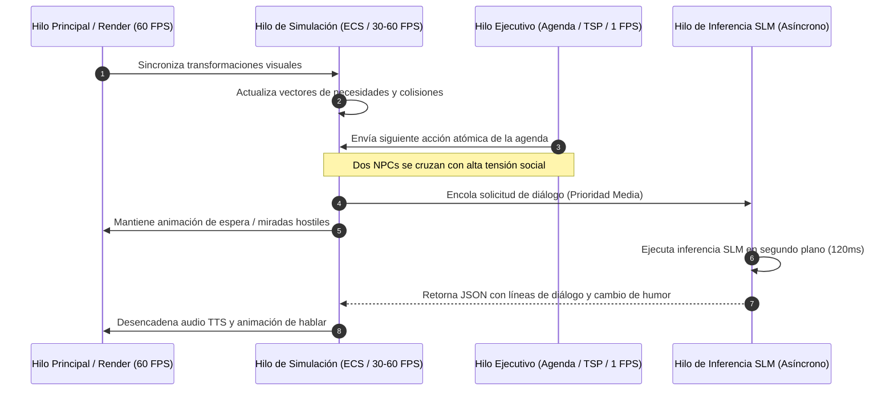

# 01. Arquitectura del Sistema: El Modelo del "Cerebro Triuno"

Este documento describe la arquitectura global de software de **Sentient NPC Architecture (SNA)**, estructurada para desacoplar el rendimiento en tiempo real del motor del juego (60 FPS) de la inferencia de lenguaje natural y la cognición reflexiva.

---

## 1. El Problema del Cuello de Botella en la IA de Videojuegos

En un videojuego tradicional, cada NPC consume un presupuesto estricto de CPU (habitualmente **< 0.1 milisegundos por frame** para toda la lógica de IA en títulos con cientos de entidades).

Los Modelos de Lenguaje (LLMs), incluso los más pequeños (0.5B - 3B), tienen latencias de inferencia de entre **20 ms y 500 ms** por petición. Si el bucle de actualización del juego (`Update()`) invocase directamente un modelo de lenguaje, el juego sufriría una congelación de fotogramas masiva (*stuttering* catastrófico).

### La Solución de SNA: Desacoplamiento Temporal Jerárquico
La mente del NPC se divide en tres subsistemas concurrentes con frecuencias de actualización independientes por órdenes de magnitud:

```
+-------------------------------------------------------------------------+
|                  NIVEL 3: COGNITIVO / GENERATIVO                        |
|  * Frecuencia: Basada en eventos (0.01 - 0.1 Hz) / 10s - 100s          |
|  * Tecnologías: SLM Local (GGUF / ONNX), Embeddings, RAG                |
|  * Responsabilidades: Diálogo, reflexión, cambios de opinión, metas     |
+-------------------------------------------------------------------------+
                                    ▲  │ (Intenciones / Decisiones mayores)
       (Estímulos / Hechos clave)   │  ▼
+-------------------------------------------------------------------------+
|                  NIVEL 2: EJECUTIVO / ESPACIAL                          |
|  * Frecuencia: Regular / Táctico (0.5 - 2 Hz) / 0.5s - 2s               |
|  * Tecnologías: Planificador GOAP, Optimizador TSP, HPA* Navigation     |
|  * Responsabilidades: Resolver rutas, itinerario del día, inventario   |
+-------------------------------------------------------------------------+
                                    ▲  │ (Acciones atómicas / Destinos)
       (Colisiones / Pánico)        │  ▼
+-------------------------------------------------------------------------+
|                  NIVEL 1: FISIOLÓGICO / REACTIVO                        |
|  * Frecuencia: Tiempo Real (30 - 60 Hz) / 16.6ms                        |
|  * Tecnologías: ECS (Data-Oriented), Utility AI Curves, Sensores        |
|  * Responsabilidades: Hambre, energía, evasión, animación, sobresalto   |
+-------------------------------------------------------------------------+
```

---

## 2. Desglose de Capas

### Capa 1: Sistema Fisiológico y Reactivo (*Fast Tick - 60 FPS*)
* **Arquitectura:** Basado en componentes puros orientados a datos (**ECS - Entity Component System**). Los datos de miles de NPCs residen contiguos en memoria caché L1/L2.
* **Componentes clave:**
  * `NeedsComponent`: Struct con enteros de 8 bits para cada necesidad (`hunger`, `thirst`, `energy`, `social`, `fun`, `bladder`).
  * `EmotionalStateComponent`: Vector 3D en espacio PAD (*Pleasure, Arousal, Dominance*).
  * `PerceptionSensorComponent`: Cono de visión y radio de audición simplificado (broadphase espacial con BVH o Spatial Hash Grid).
  * `ReactiveReflexComponent`: Interrupciones inmediatas (ej. esquivar proyectiles, huir ante fuego o caída de rocas).
* **Mecanismo de Selección de Acción:** **Utility AI**. Cada necesidad evalúa una curva matemática de respuesta no lineal (curvas sigmoidales o de potencias). La acción fisiológica más urgente gana la ejecución motora inmediata sin consultar a ninguna otra capa.

### Capa 2: Sistema Ejecutivo y Espacial (*Tactical Tick - 1 Hz*)
* **Arquitectura:** Bucle de planificación ejecutado cada 1 a 2 segundos en un hilo secundario de simulación (*Simulation Worker Thread*).
* **Componentes clave:**
  * `ScheduleComponent`: Agenda horaria flexible (ej. 08:00 Desayunar, 09:00 Cosechar trigo, 14:00 Vender en mercado).
  * `TaskSequenceOptimizer (TSP)`: Optimizador de tareas dispersas que reduce la distancia recorrida en la jornada mediante heurísticas *2-opt* sobre grafos de Puntos de Interés (POI).
  * `MacroNavigation`: Planificación jerárquica de rutas mediante HPA* (*Hierarchical Pathfinding*).

### Capa 3: Sistema Cognitivo y Generativo (*Slow / Event-Driven Tick*)
* **Arquitectura:** Totalmente asíncrono con cola de prioridad (*Priority Task Queue*) atendida por un hilo dedicado de inferencia de IA (*Inference Worker Thread*).
* **Desencadenantes (*Triggers*):**
  1. **Interacción con el jugador:** El jugador inicia una conversación o comete un delito presenciado por el NPC.
  2. **Intercambio social espontáneo:** Dos NPCs con alta afinidad o conflicto coinciden en un mismo nodo social (taberna, banco de plaza).
  3. **Eventos de quiebre emocional (*Mental Break Trigger*):** El vector de necesidades o estrés supera un umbral crítico (estilo *RimWorld*).
  4. **Fase de Consolidación Nocturna:** Durante el sueño, se procesa la memoria del día.
* **Salida de la Capa:** Nunca genera comandos directos de bajo nivel. Genera **intenciones semánticas en JSON validado** que la Capa Ejecutiva y Reactiva traducen a estados del juego.

---

## 3. Modelo de Hilos y Concurrencia

Para garantizar cero caídas de frames en el renderizado del juego, los hilos se segregan de la siguiente manera:



---

## 4. Bus de Eventos y Pizarra (*Blackboard Architecture*)

Cada NPC posee una **Pizarra Individual (*Local Blackboard*)** y acceso de solo lectura a la **Pizarra de Zona (*World Blackboard*)**.

### Estructura de la Pizarra Individual
```json
{
  "npc_id": "mateo_tabernero_01",
  "current_lod": 0,
  "needs": {
    "hunger": 42,
    "energy": 68,
    "social": 85,
    "stress": 74
  },
  "current_intent": {
    "action": "confront_rival",
    "target_id": "bruno_herrero_02",
    "priority": 80,
    "timeout": 45.0
  },
  "active_dialogue": null,
  "threat_level": 0.0
}
```

### Regla de Comunicación entre Capas:
1. **Descendente (Cerebro Lento $\to$ Cerebro Rápido):** La Capa Cognitiva escribe una *Intención* en la Pizarra. La Capa Ejecutiva la divide en acciones atómicas. La Capa Reactiva las ejecuta físicamente.
2. **Ascendente (Cerebro Rápido $\to$ Cerebro Lento):** La Capa Reactiva o de Sensores detecta un evento anómalo (ej. un robo o un insulto) y deposita un `ObservationEvent` en el búfer de entrada de la Capa Cognitiva.

---

## 5. Resumen de Tolerancia a Fallos y Fallbacks

Si el sistema de lenguaje local sufre una sobrecarga o latencia excesiva:
* **Fallback a Líneas Arquetípicas (*Fallback Bark System*):** Si la cola del SLM supera un tiempo límite de espera (ej. > 800 ms para un diálogo de saludo), el NPC recurre a un banco clásico de líneas de voz prefijadas según su arquetipo de personalidad, sin bloquear nunca la partida.
* **Degradación Elegante:** Bajo estrés de CPU, los ticks de la Capa Ejecutiva se espacian dinámicamente de 1 Hz a 0.2 Hz (1 tick cada 5 segundos para NPCs lejanos).
