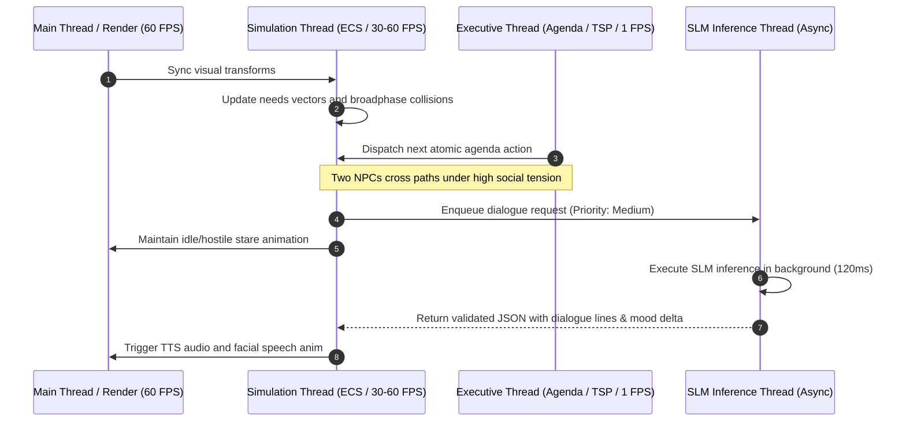

# 01. System Architecture: The "Triune Brain" Model

This document outlines the software architecture of **Sentient NPC Architecture (SNA)**, structured to decouple real-time game engine performance (60 FPS) from natural language inference and reflective cognition.

---

## 1. The Bottleneck in Video Game AI

In conventional game development, each NPC operates within a rigid CPU budget (typically **< 0.1 milliseconds per frame** across all AI logic in titles featuring hundreds of active entities).

Language models (LLMs/SLMs), even lightweight variants (0.5B – 3B parameters), incur inference latencies ranging from **20 ms to 500 ms** per call. If the primary game update loop (`Update()`) were to invoke a language model synchronously, the game would experience catastrophic frame drops and severe hitching.

### SNA Solution: Hierarchical Temporal Decoupling

The NPC cognitive stack is segregated into three concurrent subsystems with tick frequencies separated by orders of magnitude:

```
+-------------------------------------------------------------------------+
|                    TIER 3: COGNITIVE / GENERATIVE                       |
|  * Frequency: Event-Driven (0.01 - 0.1 Hz) / 10s - 100s                 |
|  * Technologies: Local SLM (GGUF / ONNX), Embeddings, RAG               |
|  * Responsibilities: Dialogue, reflection, opinion shifts, high goals   |
+-------------------------------------------------------------------------+
                                    ▲  │ (Intents / High-level decisions)
       (Key stimuli / Event logs)   │  ▼
+-------------------------------------------------------------------------+
|                    TIER 2: EXECUTIVE / SPATIAL                          |
|  * Frequency: Regular / Tactical (0.5 - 2 Hz) / 0.5s - 2s               |
|  * Technologies: GOAP Planner, k-Alternatives & Ripple Insertion, HPA*  |
|  * Responsibilities: Route resolution, daily itinerary, inventory       |
+-------------------------------------------------------------------------+
                                    ▲  │ (Atomic actions / Destinations)
       (Collisions / Panic triggers)│  ▼
+-------------------------------------------------------------------------+
|                    TIER 1: PHYSIOLOGICAL / REACTIVE                     |
|  * Frequency: Real-Time (30 - 60 Hz) / 16.6ms                           |
|  * Technologies: ECS (Data-Oriented), Utility AI Curves, Sensors        |
|  * Responsibilities: Hunger, energy, evasion, animation, flinching      |
+-------------------------------------------------------------------------+
```

---

## 2. Layer Breakdown

### Layer 1: Physiological and Reactive System (*Fast Tick - 60 FPS*)
* **Architecture:** Built on a pure data-oriented **ECS (Entity Component System)** design. Data for hundreds of NPCs is kept contiguous in L1/L2 CPU cache.
* **Core Components:**
  * `NeedsComponent`: Struct of 8-bit unsigned integers representing internal drives (`hunger`, `thirst`, `energy`, `social`, `fun`, `bladder`).
  * `EmotionalStateComponent`: Continuous 3D vector in PAD space (*Pleasure, Arousal, Dominance*).
  * `PerceptionSensorComponent`: Vision cone and hearing radius with spatial partitioning acceleration (BVH or Spatial Hash Grid).
  * `ReactiveReflexComponent`: Zero-latency reflex interrupts (e.g., projectile dodging, fleeing fire, avoiding falling debris).
* **Action Selection Mechanism:** **Utility AI**. Each biological drive evaluates a non-linear response curve (sigmoid or exponential curves). The most urgent drive wins motor execution immediately without querying higher layers.

### Layer 2: Executive and Spatial System (*Tactical Tick - 1 Hz*)
* **Architecture:** Planning cycle executed every 1 to 2 seconds on a dedicated *Simulation Worker Thread*.
* **Core Components:**
  * `ScheduleComponent`: Flexible circadian timetable (e.g., 08:00 Breakfast, 09:00 Harvest wheat, 14:00 Trade at market).
  * `TaskSequenceOptimizer (Dual TSP)`: Combines **k-Alternatives** for daily itinerary planning (with learned heuristic lists) and **Ripple Insertion** for dynamic, real-time interrupt routing (<0.05 ms) over Point of Interest (POI) graphs.
  * `MacroNavigation`: Hierarchical route planning using HPA* (*Hierarchical Pathfinding*).

### Layer 3: Cognitive and Generative System (*Slow / Event-Driven Tick*)
* **Architecture:** Fully asynchronous priority queue serviced by an *Inference Worker Thread*.
* **Triggers:**
  1. **Player Interaction:** Player initiates a dialogue or commits a visible crime.
  2. **Spontaneous Social Exchange:** Two NPCs with high social affinity or intense rivalry encounter each other at an interaction node (tavern, market bench).
  3. **Mental Break Triggers:** Stress or need vectors breach a critical threshold (*RimWorld*-style breakdown).
  4. **Nightly Consolidation Phase:** Sleep cycle activates day-to-night memory synthesis.
* **Output:** The layer never issues raw motor commands. It emits **schema-validated JSON semantic intents**, which Layers 2 and 1 translate into physical game states.

---

## 3. Threading and Concurrency Model

To guarantee zero frame drops on the main rendering loop, thread responsibilities are segregated:



---

## 4. Blackboard Architecture and Event Bus

Each NPC maintains a **Local Blackboard** with read-only query access to the **World Blackboard**.

### Local Blackboard Structure
```json
{
  "npc_id": "matthew_tavernkeeper_01",
  "current_lod": 0,
  "needs": {
    "hunger": 42,
    "energy": 68,
    "social": 85,
    "stress": 74
  },
  "current_intent": {
    "action": "confront_rival",
    "target_id": "bruno_blacksmith_02",
    "priority": 80,
    "timeout": 45.0
  },
  "active_dialogue": null,
  "threat_level": 0.0
}
```

### Inter-Layer Communication Rules:
1. **Top-Down (Slow Brain $\to$ Fast Brain):** The Cognitive Layer writes an *Intent* to the Blackboard. The Executive Layer breaks it down into atomic waypoints and tasks. The Reactive Layer executes physics and locomotion.
2. **Bottom-Up (Fast Brain $\to$ Slow Brain):** When perception detects an anomalous event (theft, assault, insult), an `ObservationEvent` is dispatched to the Cognitive Layer's input buffer.

---

## 5. Fault Tolerance and Graceful Degradation

If the local SLM experiences resource contention or latency spikes:
* **Fallback Bark System:** If the inference queue exceeds a latency threshold (e.g., > 800 ms for an interactive greeting), the NPC seamlessly defaults to an archetypal voice-bark table matching their personality matrix, preventing gameplay stalls.
* **Dynamic Throttling:** Under heavy CPU load, Executive Layer tick rates throttle smoothly from 1 Hz down to 0.2 Hz (one tick every 5 seconds for distant NPCs).
