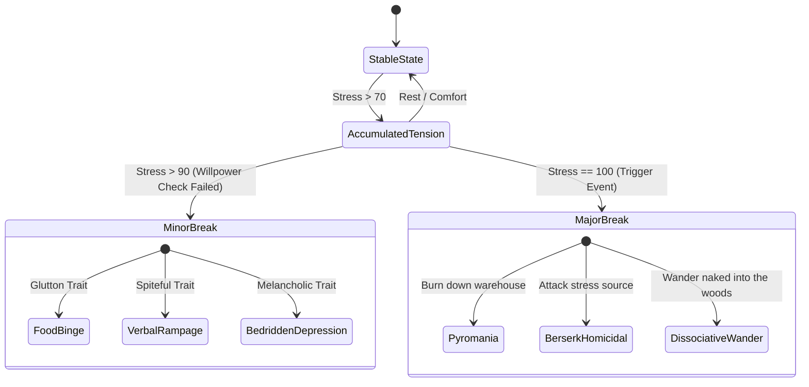

# 02. Character Model and Psychology

This document details the internal psychological architecture of each NPC within **SNA**. The goal is to provide a multi-dimensional personality profile that simultaneously shapes both **continuous mathematical simulation (Utility AI)** and **the tone and semantics of language model responses (SLM)**.

---

## 1. The Psychological Core: OCEAN Dimensions (Big Five)

Every character possesses a continuous personality vector $\mathbf{P} \in [-1.0, 1.0]^5$ based on the Five Factor Model of modern psychology:

$$\mathbf{P} = \langle O, C, E, A, N \rangle$$

```
[-1.0] ────────────────────────────────────────── [0.0] ────────────────────────────────────────── [+1.0]
Traditional, routine                 (O) Openness                          Curious, experimental
Disorganized, careless               (C) Conscientiousness                 Disciplined, meticulous
Reserved, solitary                   (E) Extraversion                      Sociable, outgoing
Hostile, cynical, suspicious         (A) Agreeableness                     Empathetic, altruistic, trusting
Calm, stress-resilient               (N) Neuroticism                       Anxious, moody, volatile
```

### Dual Impact (Simulation vs. Language Generation):
1. **Mathematical Simulation (ECS / Utility AI):**
   * **$E$ (Extraversion):** Governs the decay rate of the `Social` need. Higher $E$ accelerates loneliness, boosting the utility of visiting the tavern or seeking conversations.
   * **$C$ (Conscientiousness):** Defines the penalty threshold for abandoning work duties. A character with $C = 0.9$ will continue farming even under moderate hunger.
   * **$N$ (Neuroticism):** Acts as a multiplier on stress accumulation during setbacks and lowers the threshold for psychological breakdowns (*Mental Breaks*).
2. **Language Model Conditioning (System Prompt):**
   * Personality variables map directly to lexical behavioral guidelines:
     * $A < -0.5 \implies$ *"Speak with disdain, suspect hidden motives, and refuse unearned assistance."*
     * $O > 0.6 \implies$ *"Show deep curiosity regarding novel ideas, strange rumors, and exotic artifacts."*

---

## 2. Discrete Personality Traits (Traits Matrix)

Drawing inspiration from titles like *RimWorld* and *Crusader Kings*, each NPC can equip 2 to 4 discrete traits that modify specific game rules and serve as narrative anchors:

| Trait | Mechanical Modifier (Simulation) | Conversational Modifier (SLM) |
| :--- | :--- | :--- |
| **Spiteful** | Social opinion penalties decay 80% slower. | Constantly references past grievances; uses passive-aggressive remarks. |
| **Glutton** | Hunger accumulates 50% faster; eating grants double pleasure. | Frequently discusses food, feasts, or complains about rations. |
| **Paranoid** | Threat detection radius doubled; maximum trust capped at 40/100. | Suspects conspiracies; accuses the player of espionage. |
| **Hopeless Romantic** | Attraction multiplier doubled; suffers severe mood penalties after rejection. | Flirts easily; showers compliments on favored characters. |
| **Kleptomaniac** | Autonomous chance to steal unattended items when vision sensors confirm no witnesses. | Justifies theft as "rightful salvaging" when confronted. |
| **Stoic** | Stress bar fills 60% slower; ignores minor physical pain penalties. | Gives terse, dry responses without complaining or displaying emotion. |

---

## 3. Phobias and Philias: Reactive Reflex Triggers

Phobias and philias operate as **top-priority reflex interrupts**:

### A) Phobias (Immediate Evasion Triggers)
When perception sensors detect a phobic stimulus within radius $R$:
1. Current agenda task is immediately suspended.
2. The emotional vector polarizes instantly toward extreme panic.
3. Direct motor evasion behavior (*Flee Path*) is activated.

* **Pyrophobia (Fear of Fire):** Triggers panic if open flames, torches, or bonfires are $< 8\text{ m}$.
* **Claustrophobia (Fear of Confined Spaces):** Exponential stress accumulation inside small windowless interiors.
* **Nyctophobia (Fear of Darkness):** Refusal to venture out at night without a light source; reduced movement speed.
* **Ailurophobia / Cynophobia:** Panic or revulsion triggered by specific domestic animals.

### B) Philias / Affinities (Reward Modifiers)
* **Bibliophilia:** Spending time in libraries or study areas triples fun recovery rates.
* **Dendrophilia / Nature Affinity:** Outdoor forestry work reduces passive stress accumulation to 0.

---

## 4. Biological Needs Vector and Utility Curves

An NPC's physiological state is computed at 60 FPS via an unsigned byte vector:

$$\mathbf{N} = \begin{bmatrix} \text{Hunger} \\ \text{Thirst} \\ \text{Energy} \\ \text{Bladder} \\ \text{Social} \\ \text{Fun} \\ \text{Stress} \end{bmatrix}, \quad \text{where each variable } x \in [0, 100]$$

```
Utility
Score (U)
 1.0 ┼                                        ╭───────────── (Critical Urgency)
     │                                     ╭──╯
     │                                  ╭──╯
 0.5 ┼                               ╭──╯
     │                           ╭───╯
     │                  ╭────────╯
 0.0 ┼──────────────────┴───────────────────────────────────────
     0                 40           70        90           100   Drive Level (x)
                    (Normal)    (Annoyed)  (Alert)    (Breakdown)
```

### Utility Score Equation (Modified Sigmoid Curve):
$$U_i(x) = \frac{1}{1 + e^{-k_i \cdot (x - x_{0,i})}} \cdot w_i$$
* $x$: Current drive level (0 to 100).
* $x_{0,i}$: Inflection point where urgency rises sharply (e.g., $x_0 = 70$ for hunger).
* $k_i$: Curve slope (urgency aggression).
* $w_i$: Trait-modulated weighting (e.g., higher for a glutton evaluating hunger).

---

## 5. Continuous Emotional Space: PAD Model

Rather than discrete categorical labels ("sad", "happy"), emotional state is modeled as a continuous 3D coordinate space following Albert Mehrabian's PAD theory:

1. **Pleasure ($P \in [-1.0, 1.0]$):** Valence of emotional state (from agony/despair to bliss/ecstasy).
2. **Arousal ($A \in [-1.0, 1.0]$):** Level of physiological activation and alertness (from sleep/calm to cardiac agitation/frenzy).
3. **Dominance ($D \in [-1.0, 1.0]$):** Sense of environmental control (from helplessness/submissiveness to mastery and empowerment).

### Mapping Classical Emotional States into PAD Space:
| Emotion | Pleasure ($P$) | Arousal ($A$) | Dominance ($D$) | Behavioral Expression |
| :--- | :---: | :---: | :---: | :--- |
| **Terrified / Panicked** | $-0.8$ | $+0.9$ | $-0.9$ | Flees erratically, screams, ignores normal interaction. |
| **Furious / Enraged** | $-0.7$ | $+0.8$ | $+0.8$ | Confronts physically, launches insults, initiates brawls. |
| **Bored / Apathetic** | $-0.3$ | $-0.7$ | $-0.2$ | Drags feet, yawns, ignores minor social cues. |
| **Euphoric / Triumphant**| $+0.9$ | $+0.8$ | $+0.7$ | Generous, buys rounds at the tavern, speaks exuberantly. |
| **Depressed / Despondent**| $-0.8$ | $-0.6$ | $-0.7$ | Secludes at home, skips meals, weeps in private. |

---

## 6. Biographical Lore Anchors

To ensure the language model retains historic grounding without ballooning context tokens, biographical background is serialized into a **compact, structured JSON schema**:

```json
{
  "id": "elena_apothecary_03",
  "name": "Elena Rios",
  "age": 29,
  "occupation": "Village herbalist and healer",
  "origin": "Apprenticed at the capital's guild of alchemists, fled following false poisoning accusations",
  "core_trauma": "Witnessed her mentor hung at the gallows; harbors deep visceral distrust toward guards and magistrates",
  "life_goal": "Discover a definitive cure for swamp fever and clear her mentor's name",
  "ethical_values": {
    "loyalty": "High toward the vulnerable",
    "respect_for_authority": "Extremely low; views law as fundamentally corrupt",
    "materialism": "Low; prefers bartering for rare herbs over coin"
  }
}
```

---

## 7. Psychological Crises (Mental Breaks)

When `Stress` exceeds the critical threshold ($> 90$) over sustained periods (e.g., starvation + public humiliation + sleep deprivation), a **Mental Break** triggers:



During a Mental Break:
* The Executive Layer (routine schedule) is **completely suspended**.
* The NPC obsessively executes the breakdown compulsion for several in-game hours.
* If spoken to, the SLM emits incoherent rambling, shouting, or delirium reflecting the crisis.
