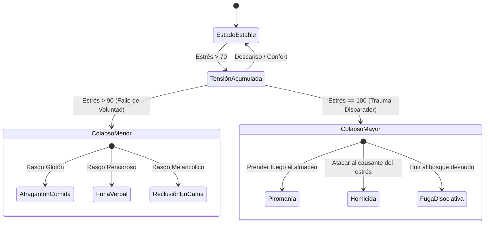

# 02. Modelo de Personaje y Psicología

Este documento detalla la estructura psicológica interna de cada NPC en **SNA**. El objetivo es proporcionar un perfil multidimensional que condicione simultáneamente tanto las **ecuaciones matemáticas de la simulación continua (Utility AI)** como el **tono y contenido de las respuestas del modelo de lenguaje (SLM)**.

---

## 1. El Núcleo Psicológico: Dimensiones OCEAN (Big Five)

Cada personaje posee un vector de personalidad continuo $\mathbf{P} \in [-1.0, 1.0]^5$ basado en el modelo de los Cinco Grandes factores de la psicología moderna:

$$\mathbf{P} = \langle O, C, E, A, N \rangle$$

```
[-1.0] ────────────────────────────────────────── [0.0] ────────────────────────────────────────── [+1.0]
Tradicional, rutinario               Apertura (O)                         Curioso, experimental
Desorganizado, perezoso            Responsabilidad (C)                    Disciplinado, meticuloso
Solitario, taciturno                Extroversión (E)                       Sociable, expresivo
Hostil, egoísta, suspicaz            Amabilidad (A)                       Empático, altruista, confiado
Calmado, resistente al estrés       Neuroticismo (N)                      Ansioso, impulsivo, reactivo
```

### Impacto Dual (Simulación vs. Generación de Lenguaje):
1. **En la Simulación Matemática (ECS / Utility AI):**
   * **$E$ (Extroversión):** Modifica la tasa de decaimiento de la necesidad `Social`. A mayor $E$, más rápido siente soledad y más valor le otorga a visitar la taberna o conversar.
   * **$C$ (Responsabilidad):** Define el umbral de penalización para abandonar su puesto de trabajo. Un $C = 0.9$ trabajará incluso con hambre moderada.
   * **$N$ (Neuroticismo):** Aumenta el multiplicador de estrés ante imprevistos y reduce la resistencia antes de un colapso mental (*Mental Break*).
2. **En el Modelo de Lenguaje (Prompt Conditioning):**
   * Las variables se mapean a descriptores léxicos en el prompt del sistema:
     * $A < -0.5 \implies$ *"Hablas con desdén, sospechas de segundas intenciones y no ofreces ayuda fácilmente."*
     * $O > 0.6 \implies$ *"Muestras fascinación por ideas nuevas, rumores extraños y objetos exóticos."*

---

## 2. Rasgos Discretos de Personalidad (*Traits Matrix*)

Inspirado en títulos como *RimWorld* y *Crusader Kings*, cada NPC puede equipar de 2 a 4 rasgos discretos que modifican reglas específicas del juego y actúan como "anclas narrativas":

| Rasgo | Modificador Mecánico (Simulación) | Modificador Conversacional (SLM) |
| :--- | :--- | :--- |
| **Rencoroso** | Las penalizaciones de opinión social decaen un 80% más lento. | Recuerda afrentas pasadas e inserta reproches pasivo-agresivos. |
| **Glotón** | La tasa de hambre es un 50% mayor; comer otorga el doble de placer. | Tiende a hablar de comida, banquetes o quejarse de la escasez de víveres. |
| **Paranoico** | Su rango de detección de amenazas se duplica; la confianza máxima hacia otros tiene un tope de 40. | Sospecha conspiraciones, acusa al jugador de espiarle. |
| **Romántico Empedernido** | El multiplicador de atracción se duplica; sufre penalizaciones de ánimo severas tras un rechazo. | Coquetea con facilidad y elogia a personajes afines. |
| **Cleptómano** | Probabilidad autónoma de hurtar objetos si el sensor visual indica que nadie mira. | Justifica sus robos como "hallazgos legítimos" si es confrontado. |
| **Estoico** | La barra de estrés sube un 60% más lento; no sufre penalizaciones por dolor físico leve. | Respuestas lacónicas, sin quejas ni efusividad emocional. |

---

## 3. Fobias y Filias: Disparadores de Respuesta Reactiva

Las fobias y filias actúan como **interruptores reflejos de prioridad máxima**:

### A) Fobias (Disparadores de Evasión Inmediata)
Cuando el sistema sensorial detecta un estímulo fóbico en un radio $R$:
1. Se anula la tarea actual de la agenda.
2. El vector emocional se polariza instantáneamente hacia pánico extremo.
3. Se activa un comportamiento motor de huida directa (*Flee Path*).

* **Pirofobia (Miedo al fuego):** Pánico si hay antorchas, hogueras o incendios a $< 8\text{ m}$.
* **Claustrofobia (Miedo a espacios cerrados):** Acumulación exponencial de estrés si el NPC permanece en interiores pequeños sin ventanas.
* **Nictofobia (Miedo a la oscuridad):** Negativa a salir de noche sin fuente de luz; velocidad de movimiento reducida.
* **Ailurofobia / Cinofobia:** Reacción de pánico o aversión hacia animales domésticos específicos.

### B) Filias / Aficiones (Modificadores de Recompensa)
* **Bibliofilia:** Pasar tiempo en bibliotecas o salas de lectura multiplica por 3 la recuperación de diversión.
* **Dendrofilia / Naturismo:** Trabajar al aire libre en bosques reduce el estrés pasivo a 0.

---

## 4. Vector de Necesidades Biológicas y Curvas de Utilidad

El estado fisiológico de cada NPC se computa a 60 FPS mediante un vector de enteros:

$$\mathbf{N} = \begin{bmatrix} \text{Hambre} \\ \text{Sed} \\ \text{Energía} \\ \text{Vejiga} \\ \text{Social} \\ \text{Diversión} \\ \text{Estrés} \end{bmatrix}, \quad \text{donde cada valor } x \in [0, 100]$$

```
Puntuación
de Utilidad (U)
 1.0 ┼                                        ╭───────────── (Urgencia Crítica)
     │                                     ╭──╯
     │                                  ╭──╯
 0.5 ┼                               ╭──╯
     │                           ╭───╯
     │                  ╭────────╯
 0.0 ┼──────────────────┴───────────────────────────────────────
     0                 40           70        90           100   Nivel de Necesidad
                     (Normal)    (Molestia) (Alerta)    (Colapso)
```

### Ecuación de Puntuación de Utilidad (Curva Sigmoide Modificada):
$$U_i(x) = \frac{1}{1 + e^{-k_i \cdot (x - x_{0,i})}} \cdot w_i$$
* $x$: Nivel actual de la necesidad (0 a 100).
* $x_{0,i}$: Punto de inflexión donde la necesidad empieza a ser prioritaria (ej. $x_0 = 70$ para hambre).
* $k_i$: Pendiente de la curva (agresividad de la urgencia).
* $w_i$: Ponderación modulada por los rasgos del personaje (un glotón tiene mayor peso para el hambre).

---

## 5. Espacio Emocional Continuo: Modelo PAD

En lugar de etiquetas estáticas ("triste", "alegre"), el estado de ánimo se define en un espacio tridimensional continuo según la teoría de Albert Mehrabian:

1. **Placer ($P \in [-1.0, 1.0]$):** Valencia del estado emocional (desde desesperación/dolor hasta éxtasis).
2. **Excitación ($A \in [-1.0, 1.0]$):** Nivel de activación fisiológica y energía (desde sopor/calma hasta taquicardia/agitación).
3. **Dominancia ($D \in [-1.0, 1.0]$):** Sensación de control sobre el entorno (desde sumisión/impotencia hasta empoderamiento y seguridad).

### Mapeo de Estados Emocionales Clásicos en el Espacio PAD:
| Emoción | Placer ($P$) | Excitación ($A$) | Dominancia ($D$) | Comportamiento del NPC |
| :--- | :---: | :---: | :---: | :--- |
| **Aterrado / Pánico** | $-0.8$ | $+0.9$ | $-0.9$ | Huye desorientado, grita, no responde a llamadas. |
| **Furioso / Agresivo** | $-0.7$ | $+0.8$ | $+0.8$ | Confronte directo, insulta, amenaza física, puñetazos. |
| **Aburrido / Apático** | $-0.3$ | $-0.7$ | $-0.2$ | Camina arrastrando los pies, bosteza, ignora estímulos leves. |
| **Eufórico / Triunfante**| $+0.9$ | $+0.8$ | $+0.7$ | Generoso, invita a rondas en la taberna, habla efusivamente. |
| **Deprimido / Abatido** | $-0.8$ | $-0.6$ | $-0.7$ | Se recluye en su casa, no come a tiempo, llora en soledad. |

---

## 6. Anclas Biográficas (*Lore Anchors*)

Para que el modelo de lenguaje tenga coherencia histórica sin saturar la ventana de contexto, la biografía se serializa como un **esquema JSON estructurado y conciso**:

```json
{
  "id": "elena_curandera_03",
  "nombre": "Elena Ríos",
  "edad": 29,
  "ocupacion": "Boticaria y curandera de la aldea",
  "origen": "Creció en la capital como aprendiz del gremio de alquimistas, pero huyó tras una acusación falsa de envenenamiento",
  "trauma_fundacional": "Vio a su maestro ser ejecutado en la horca; desconfía visceralmente de los guardias y autoridades",
  "meta_vital": "Descubrir una cura para la fiebre del pantano y limpiar su nombre",
  "valores_eticos": {
    "lealtad": "Alta hacia los desvalidos",
    "respeto_a_la_ley": "Muy bajo; considera corruptas las instituciones",
    "apego_al_dinero": "Bajo; prefiere el trueque por hierbas raras"
  }
}
```

---

## 7. Crisis Psicológicas (*Mental Breaks*)

Cuando el nivel de `Estrés` supera el valor crítico ($> 90$) durante un tiempo continuado (por ejemplo, hambre extrema + humillación social + falta de sueño), se detona un **Colapso Mental**:



Durante un Colapso Mental:
* La Capa Ejecutiva (la agenda) queda **totalmente desactivada**.
* El NPC ejecuta exclusivamente el comportamiento compulsivo del colapso durante varias horas de juego.
* Si el jugador intenta hablar con el NPC, el SLM genera balbuceos, gritos o frases delirantes acordes a la crisis.
