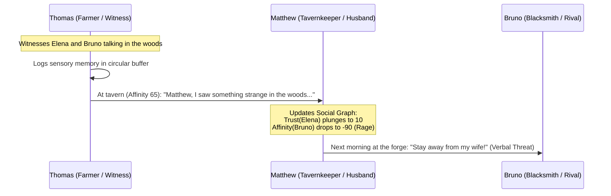

# 03. Dynamic Social Graph and Drama Engine

This document formalizes the interpersonal relational network and emergent narrative system (*Drama Engine*) of **SNA**. It empowers NPCs to form friendships, marriages, rivalries, jealousies, and alliances organically without pre-scripted narrative rails.

---

## 1. Asymmetric Social Graph Topology

The simulated society is modeled as a **Weighted Directed Graph**:

$$\mathcal{G} = (\mathcal{V}, \mathcal{E})$$

* $\mathcal{V}$: Set of agents (NPCs and the Player).
* $\mathcal{E}$: Directed edges where $e_{ij} = (v_i \to v_j)$ represents agent $i$'s subjective perception and feelings toward agent $j$.

> [!IMPORTANT]
> **Fundamental Asymmetry:** Edge $v_i \to v_j$ is **not necessarily equal** to $v_j \to v_i$. An NPC may harbor unrequited romantic obsession toward another, while the target feels complete indifference or antipathy.

```
       [Matthew (Tavernkeeper)]
          │              ▲
          │ e_12         │ e_21
          ▼              │
     [Elena (Apothecary)] ┼────── e_23 ──────► [Bruno (Blacksmith)]
                         ◄────── e_32 ───────┘
```

### Relational Edge Attribute Tuple:
$$e_{ij} = \langle \text{Affinity}, \text{Trust}, \text{Romance}, \text{Dominance}, \text{Familiarity} \rangle$$

1. **Affinity ($[-100, +100]$):** Overall sentiment and fondness (from lethal hatred to fraternal devotion).
2. **Trust ($[0, 100]$):** Belief in the counterpart's integrity (controls whether secrets are shared, trade credit is extended, or warnings believed).
3. **Romance ($[0, 100]$):** Romantic attraction and desire for courtship.
4. **Dominance ($[-100, +100]$):** Deference or intimidation ($-100$: agent $i$ disdains $j$'s authority; $+100$: agent $i$ fears or submissively obeys $j$).
5. **Familiarity ($[0, 100]$):** Depth of mutual history (from total stranger to lifelong companion).

---

## 2. Discrete Relational States and Transition Conditions

Categorical relational labels are projected over the continuous numerical state, governing baseline social protocols:

```
                   Romance > 60 + Trust > 50
    [Acquaintance] ──────────────────────────────────► [Courtship]
          │                                                  │
          │ Affinity > 70 + Trust > 70                       │ Marriage Accepted
          ▼                                                  ▼
     [Close Friend]                                     [Marriage]
          │                                                  │
          │ Betrayal / Revelation                            │ Infidelity / Divorce
          ▼                                                  ▼
       [Rival] ◄───────────────────────────────────────── [Ex-Spouse]
```

### Relational States Matrix:
| State | Numerical Thresholds | Gameplay Manifestation |
| :--- | :--- | :--- |
| **Stranger** | $\text{Familiarity} < 10$ | Distant, formal manners; refuses personal favors. |
| **Close Friend** | $\text{Affinity} > 60 \land \text{Trust} > 60$ | Merchant discounts, financial loans, intervention in fights. |
| **Courtship** | $\text{Romance} > 50 \land \text{Affinity} > 40$ | Gift giving, walks together, jealousy if seen with rivals. |
| **Marriage** | Completed formal ceremony | Shared housing, bed, household inventory, and pooled wealth. |
| **Rival / Enemy** | $\text{Affinity} < -50$ | Hostile glares, verbal slurs, service refusal, economic boycott. |
| **Mortal Vendetta** | $\text{Affinity} < -85 \land \text{Dominance} < 0$ | Physical assaults, nighttime arson, hiring mercenaries. |

---

## 3. Interpersonal Compatibility: Initial Affinity Formula

When two NPCs meet for the first time, initial baseline affinity is computed deterministically by comparing their OCEAN profiles and traits:

$$\text{Compatibility}(i, j) = 1.0 - \frac{1}{\sqrt{5}} \|\mathbf{P}_i - \mathbf{P}_j\|_2 + \sum \text{TraitBonus}(i, j)$$

* Shared positive traits (e.g., both are *Bibliophiles* or *Nature Lovers*) award a $+20$ affinity boost.
* Conflicting traits (e.g., *Honest* versus *Kleptomaniac*) impose an immediate $-40$ penalty.

---

## 4. Memetic Rumor and Information Propagation (Gossip Engine)

In **SNA**, information does not teleport telepathically across the world; it spreads strictly through **interpersonal contact**:

### Structure of a Rumor Packet (*Meme Packet*):
```json
{
  "rumor_id": "rumor_infidelity_042",
  "primary_subject": "elena_apothecary_03",
  "secondary_subject": "bruno_blacksmith_02",
  "action": "illicit_meeting_woods",
  "original_witness": "thomas_farmer_05",
  "timestamp": 1420.5,
  "credibility": 0.85,
  "emotional_charge": -0.8
}
```

### Transmission Mechanics between NPC A and NPC B:
1. **Gossip Probability:** Governed by A's Extraversion ($E_A$) and specific traits (*Gossip*, *Blabbermouth*).
2. **Trust Barrier:** An NPC only shares compromising rumors if $\text{Trust}_{AB} > 40$.
3. **Meme Drift (Telephone Game Distortion):**
   * Each transfer attenuates `credibility` by a multiplier ($0.85$).
   * If the sender despises the rumor's subject ($\text{Affinity}_{A \to \text{Subject}} < -30$), the negative emotional charge is artificially exaggerated:
     * *Original fact:* "Elena and Bruno spoke alone near the riverbank."
     * *Third transmission:* "Elena and Bruno are scheming to poison Matthew to seize the tavern."



---

## 5. The Drama Engine: Revenge and Crisis Triggers

The *Drama Engine* periodically inspects relational graph motifs to ignite emergent narrative arcs:

### A) The Jealousy Triangle (*Infidelity / Betrayal Pattern*)
* **Detected Motif:**
  $$\text{Married}(A, B) \land \text{Romance}(B, C) > 50 \land \text{Knows}(A, \text{Romance}(B, C))$$
* **Emergent Outcome:**
  * High Neuroticism + Low Agreeableness: Triggers physical violence or poisoning aimed at rival $C$.
  * High Conscientiousness + High Agreeableness: Formally files for divorce before the village elder and divides communal assets.

### B) Family Blood Feuds (*Vendetta Pattern*)
* If an NPC is slain or unjustly imprisoned:
  * Direct kin and close friends ($\text{Affinity} > 80$) inherit a permanent high-priority goal in their Cognitive Layer: `Goal: Ruin / Eliminate perpetrator`.
  * Hatred does not naturally decay over time; grudges cascade socially to the perpetrator's allies.

---

## 6. Integrating the Social Graph with the SLM

When generating dialogue, the system injects only the **relevant relational slice** into the prompt, keeping token overhead under 250 tokens:

```yaml
# Dynamic context injection into System Prompt
Interlocutor_Context:
  Name: Bruno
  Relationship: Commercial rival suspected of seducing your wife
  Metrics: [Affinity: -75, Trust: 5, Dominance: -40]
  Active_Rumors:
    - "Thomas told you Bruno was loitering near your house last night"
  Conversational_Directive: "Express cold disdain. Reject business offers. Issue a veiled threat."
```

This guarantees that characters with shared history never engage in generic or polite greeting loops.
