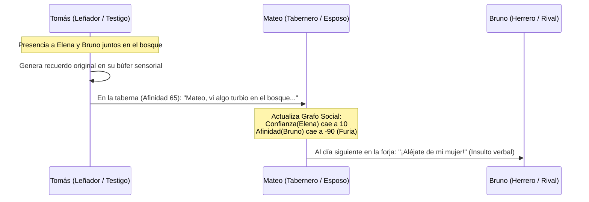

# 03. Grafo Social Dinámico y Motor de Drama

Este documento formaliza la red de relaciones interpersonales y el sistema de emergencia narrativa (*Drama Engine*) de **SNA**. El sistema permite que los NPCs formen amistades, matrimonios, celos, traiciones y alianzas de manera orgánica sin tramas pre-escritas.

---

## 1. Topología del Grafo Social Asimétrico

La sociedad del juego se modela como un **Grafo Dirigido Ponderado**:

$$\mathcal{G} = (\mathcal{V}, \mathcal{E})$$

* $\mathcal{V}$: Conjunto de agentes (NPCs y el Jugador).
* $\mathcal{E}$: Aristas dirigidas donde $e_{ij} = (v_i \to v_j)$ representa la percepción subjetiva que tiene el agente $i$ sobre el agente $j$.

> [!IMPORTANT]
> **Asimetría Esencial:** La arista $v_i \to v_j$ **nunca es necesariamente igual** a $v_j \to v_i$. Un NPC puede estar secretamente enamorado de otro, mientras que este último siente indiferencia o desprecio.

```
       [Mateo (Tabernero)]
         │              ▲
         │ e_12         │ e_21
         ▼              │
    [Elena (Boticaria)] ┼────── e_23 ──────► [Bruno (Herrero)]
                        ◄────── e_32 ───────┘
```

### Tupla de Atributos por Arista Relacional:
$$e_{ij} = \langle \text{Afinidad}, \text{Confianza}, \text{Romance}, \text{Sumisión}, \text{Familiaridad} \rangle$$

1. **Afinidad ($[-100, +100]$):** Simpatía general (de odio a muerte a aprecio fraternal).
2. **Confianza ($[0, 100]$):** Seguridad en la palabra del otro (determina si le cuenta secretos, le vende a crédito o cree sus advertencias).
3. **Romance ($[0, 100]$):** Nivel de atracción amorosa y deseo de cortejo.
4. **Sumisión ($[-100, +100]$):** Deferencia o intimidación ($-100$ el agente $i$ desprecia la autoridad de $j$; $+100$ el agente $i$ le teme o acata sus órdenes).
5. **Familiaridad ($[0, 100]$):** Grado de conocimiento mutuo (de total desconocido a convivencia de décadas).

---

## 2. Estados Relacionales Discretos y Condiciones de Transición

Sobre el espacio numérico continuo se proyectan **etiquetas relacionales** que determinan el comportamiento social básico:

```
                   Atracción > 60 + Confianza > 50
    [Conocidos] ──────────────────────────────────────► [Pretendientes]
         │                                                      │
         │ Afinidad > 70 + Confianza > 70                       │ Boda Aceptada
         ▼                                                      ▼
     [Amigos]                                              [Matrimonio]
         │                                                      │
         │ Traición / Descubrimiento                            │ Infidelidad / Divorcio
         ▼                                                      ▼
     [Enemigos] ◄────────────────────────────────────────── [Ex-Cónyuges]
```

### Tabla de Estados Relacionales:
| Estado | Condiciones Numéricas | Mecánica en Juego |
| :--- | :--- | :--- |
| **Desconocido** | $\text{Familiaridad} < 10$ | Tratamiento distante, formal; rechazo a favores. |
| **Amigo Íntimo** | $\text{Afinidad} > 60 \land \text{Confianza} > 60$ | Descuentos en tiendas, préstamos de dinero, defensa en peleas. |
| **Cortejando** | $\text{Romance} > 50 \land \text{Afinidad} > 40$ | Regalos frecuentes, paseos conjuntos, celos si habla con terceros. |
| **Matrimonio** | Rito formal completado | Comparten vivienda, cama, inventario doméstico y economía. |
| **Rival / Enemigo** | $\text{Afinidad} < -50$ | Miradas hostiles, insultos verbales, negativas de servicio, boicot comercial. |
| **Enemistad Mortal**| $\text{Afinidad} < -85 \land \text{Sumisión} < 0$ | Intentos de homicidio, sabotaje nocturno o contratación de sicarios. |

---

## 3. Compatibilidad Interpersonal: Ecuación de Afinidad Inicial

Cuando dos NPCs interactúan por primera vez, la compatibilidad biológica/psicológica inicial se calcula deterministamente comparando sus vectores OCEAN y rasgos:

$$\text{Compatibilidad}(i, j) = 1.0 - \frac{1}{\sqrt{5}} \|\mathbf{P}_i - \mathbf{P}_j\|_2 + \sum \text{BonoRasgos}(i, j)$$

* Si ambos comparten rasgos positivos (ej. ambos son *Bibliofilos* o *Naturistas*), obtienen un bono de $+20$ en afinidad.
* Si un rasgo choca frontalmente (ej. *Honesto* frente a *Cleptómano*), se aplica una penalización inmediata de $-40$.

---

## 4. Propagación Memética de Rumores e Información (*Gossip Engine*)

La información en **SNA** no se teletransporta por el mundo; viaja exclusivamente por **contacto interpersonal**:

### Estructura de un Paquete de Rumor (*Meme Packet*):
```json
{
  "rumor_id": "rumor_infidelidad_042",
  "sujeto_principal": "elena_curandera_03",
  "sujeto_secundario": "bruno_herrero_02",
  "accion": "beso_furtivo_bosque",
  "testigo_original": "tomas_lenador_05",
  "tiempo_ocurrencia": 1420.5,
  "credibilidad": 0.85,
  "carga_emocional": -0.8
}
```

### Reglas de Transmisión entre NPC A y NPC B:
1. **Frecuencia de Cotilleo:** Condicionada por la Extroversión de A ($E_A$) y rasgos como *Chismoso*.
2. **Filtro de Confianza:** Un NPC solo comparte un rumor comprometedor si $\text{Confianza}_{AB} > 40$.
3. **Distorsión Acústica / Teléfono Descompuesto (*Meme Drift*):**
   * Cada vez que un rumor pasa de un NPC a otro, la `credibilidad` se multiplica por un factor de atenuación ($0.85$).
   * Si el emisor odia al sujeto del rumor ($\text{Afinidad}_{A \to \text{Sujeto}} < -30$), la carga emocional negativa se incrementa artificialmente:
     * *Hecho original:* "Elena y Bruno hablaron cerca del río a solas".
     * *Tercera transmisión:* "Elena y Bruno están planeando envenenar a Mateo para quedarse con la taberna".



---

## 5. El Motor de Drama: Disparadores de Venganza y Crisis

El *Drama Engine* evalúa periódicamente patrones estructurales en el grafo social para detonar arcos narrativos emergentes:

### A) El Triángulo de Celos (*Infidelity / Betrayal Pattern*)
* **Patrón detectado:**
  $$\text{Matrimonio}(A, B) \land \text{Romance}(B, C) > 50 \land \text{Sabe}(A, \text{Romance}(B, C))$$
* **Acción Emergente:**
  * Si $A$ tiene Neuroticismo alto y Amabilidad baja: Desencadena confrontación física violenta o envenenamiento del rival $C$.
  * Si $A$ tiene Responsabilidad alta y Amabilidad alta: Pide formalmente el divorcio ante la autoridad local y divide los bienes.

### B) Venganza Familiar (*Blood Feud / Vendetta*)
* Si un NPC es asesinado o encarcelado injustamente:
  * Todos los familiares directos y amigos íntimos ($\text{Afinidad} > 80$) reciben una meta permanente de venganza en su Capa Cognitiva: `Objetivo: Arruinar / Destruir al causante`.
  * La hostilidad no desaparece con el tiempo; el rencor se hereda socialmente hacia los aliados del culpable.

---

## 6. Integración del Grafo Social con el Modelo de Lenguaje (SLM)

Cuando se genera un diálogo, el motor inyecta únicamente el **contexto relacional específico** de los participantes para mantener el prompt por debajo de 250 tokens:

```yaml
# Inyección contextual en el System Prompt
Contexto_Interlocutor:
  Nombre: Bruno
  Relacion: Rival de negocios y sospechoso de seducir a tu esposa
  Metricas: [Afinidad: -75, Confianza: 5, Sumision: -40]
  Rumores_Activos:
    - "Tomas te dijo que Bruno merodeaba tu casa anoche"
  Directriz_Conversacional: "Muestra desprecio frío. No aceptes sus ofertas. Lanza una advertencia velada."
```

Esto garantiza que dos NPCs con historias compartidas nunca tengan conversaciones genéricas de cortesía vacía.
