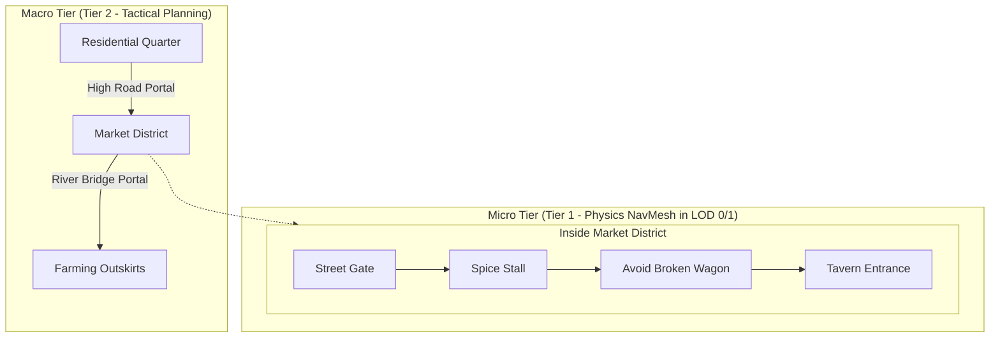

# 04. Spatial AI, Routines, and Route Optimization (TSP)

This document specifies how NPCs perceive the world environment, execute circadian daily routines, and resolve route planning and unordered errand optimization using the **Traveling Salesperson Problem (TSP)** with extreme computational efficiency.

---

## 1. World Representation: The Point of Interest (POI) Graph

To avoid CPU saturation from redundant navigation queries, the environment **is not searched grid-by-grid or polygon-by-polygon** during high-level strategic reasoning.

The world is abstracted as a **Topological Graph of Points of Interest**:

$$\mathcal{G}_{\text{world}} = (\mathcal{V}_{\text{POI}}, \mathcal{E}_{\text{transit}})$$

```
[North Farm] ═══════ (High Road) ═══════ [Flour Mill]
     ║                                        ║
     ║ (Trail)                                ║ (Cobblestone Street)
     ▼                                        ▼
[Central Market] ══════ (Town Square) ══════ [The Boar Tavern]
     ║                                        ║
     ║ (Alley)                                ║ (Tunnel)
     ▼                                        ▼
[Matthew's House] ══════════════════════════ [Bruno's Forge]
```

### Anatomy of a Point of Interest (POI):
* **ID & Category:** `market_fruit_stall`, `park_bench`, `blacksmith_anvil`, `personal_bed`.
* **Concurrency Limit:** Maximum number of agents allowed to interact concurrently (e.g., bed = 1, tavern counter = 20).
* **Affordances (Allowed Actions):** `[SLEEP, EAT, FORGE_WORK, SOCIALIZE, TRADE]`.
* **Precomputed Transit Costs:** Distance matrix $D[i, j]$ between POI nodes calculated at map build/load time.

---

## 2. Flexible Circadian Schedules

Inspired by systems in *Stardew Valley* and *Red Dead Redemption 2*, every profession uses a daily timetable template equipped with **tolerance windows**:

```
00:00        06:00       08:00           13:00   14:00           18:00           22:00       24:00
┌──────────────┬───────────┬───────────────┬───────┬───────────────┬───────────────┬───────────┐
│ Sleep in     │ Wash &    │ Field / Shop  │ Quick │ Market Trade  │ Socialize     │ Return &  │
│ Home Bed     │ Breakfast │ Labor         │ Lunch │ & Errands     │ in Tavern     │ Home Dine │
└──────────────┴───────────┴───────────────┴───────┴───────────────┴───────────────┴───────────┘
```

### Organic Interrupts (Interruption Stack):
Schedules are never rigid rails. When any of the following conditions are met, the active routine is suspended via a **Last-In, First-Out (LIFO) Interruption Stack**:
1. **Critical Drive:** If $\text{Hunger} > 85$ at 10:00 AM, the NPC pauses work and visits the pantry to eat.
2. **Adverse Weather:** If torrential downpours strike and the NPC lacks rain gear, outdoor work stops to seek shelter under eaves.
3. **Conversational Interruption:** When greeted by the player or an acquaintance, the NPC halts and turns their gaze. Once finished, they resume their active objective seamlessly.

---

## 3. Task and Route Optimization via TSP (Dual-Engine: k-Alternatives & Ripple Insertion)

### The Errand Sequencing Challenge
A villager or artisan rarely moves purely between two static points. Daily shifts frequently consist of an **unordered batch of errands ($N$ tasks)**:
* Pick up 3 sacks of grain from North Field.
* Repair damaged fence section near the sheep pen.
* Deliver harvest to the flour mill.
* Purchase fresh seeds at the central market stall.
* Deliver kitchen scraps to the chicken coop.

Visiting these destinations in arbitrary order causes frantic zig-zagging, breaking player immersion and wasting game time.

```
Naive Chaotic Route:                       Optimized Route (k-Alternatives / Ripple):
   [A] ───────────► [C]                       [A] ────────────► [B]
    │                ▲                         │                 │
    │  ╭───────────╯ │                         │                 │
    ▼  ▼             │                         ▼                 ▼
   [D] ───────────► [B]                       [D] ◄─────────── [C]
   (Crossed paths & wasted travel time)       (Natural, smooth circuit)
```

### Dual Optimization Engines: Planning vs. Dynamic Re-routing

Rather than relying on basic greedy 2-opt or costly global recomputations, the architecture decouples errand optimization into two specialized algorithmic engines:

#### 1. Planned Daily Itineraries: [k-Alternatives Meta-Heuristic](https://github.com/mcarbonell/k-alternatives-meta-algorithm)
* **When used:** Macro-planning during morning routine generation, schedule shifts, or major goal reorganization.
* **Mechanism:**
  * Uses greedy nearest-neighbor or insertion baselines augmented with **bounded $k$-deviations** (evaluating top-$k$ alternate choices at each decision branch).
  * **Adaptive Heuristic Learning:** Employs reinforcement-like list-order learning without neural network overhead. The algorithm rewards and penalizes heuristic sequencing rules based on tour quality across simulated cycles.
  * **Precedence Constraints:** Naturally handles domain dependencies (e.g., "harvest grain before visiting flour mill", "take basket before gathering eggs") without falling into greedy dead-ends.
  * **Performance:** Executes in **$< 0.05\text{ ms}$** for standard NPC errand batches ($N = 4\text{--}12$ POIs).

#### 2. Real-Time Dynamic Re-routing: [Ripple Insertion Dynamic TSP](https://github.com/mcarbonell/ripple-insertion)
* **When used:** Unplanned runtime interrupts, spontaneous player encounters, emergency rain shelter, item pickups, or dynamic obstacle avoidance.
* **Mechanism:**
  * When an NPC is mid-itinerary and suddenly acquires a new waypoint (e.g., stopping to speak with the player, or diverting to shelter), recalculating the entire TSP from scratch is computationally wasteful and disrupts temporal continuity.
  * **Recursive Insertion with Elastic Tension Relaxation:** Slices into the active tour in $O(N \log N)$ complexity, calculating the cheapest detour and propagating a local "ripple" relaxation through adjacent vertices.
  * **Continuity Guarantee:** Preserves the already committed downstream itinerary while seamlessly absorbing the new waypoint.
  * **Performance:** Executes in **$0.05\text{--}0.15\text{ ms}$**, running synchronously inside the 60 FPS Pygame/Arcade update loop without causing frame drops.

---

## 4. Hierarchical Navigation: HPA\* (*Hierarchical Pathfinding*)

To traverse large game worlds without choking the pathfinder:



1. **Macro Routing (HPA\* on Region Portal Graph):**
   * Computes transit across entire map zones in microsecond intervals.
   * Remains functional even when the NPC is operating in **LOD 2 (off-screen / background simulation)**.
2. **Micro Routing (Local NavMesh A\*):**
   * Activated only within 100 meters of the active camera (LOD 0 and LOD 1).
   * Generates steering trajectories with dynamic obstacle avoidance (other pedestrians, loose carts, debris).

---

## 5. Behavior Resumption Stack

When an unexpected event interrupts an NPC's agenda, the runtime snapshot is preserved in a LIFO stack:

```json
{
  "stack_size": 2,
  "stack": [
    {
      "state": "ROUTINE_FARM_LABOR",
      "progress": "task_3_of_5",
      "target_poi": "north_wheat_field",
      "context_data": { "sacks_gathered": 2 }
    },
    {
      "state": "PLAYER_CONVERSATION",
      "interlocutor": "player_id",
      "start_time": 842.1
    }
  ]
}
```

* Once the conversation terminates, the `PLAYER_CONVERSATION` frame is popped.
* The agent returns instantly to `ROUTINE_FARM_LABOR` with gathered goods preserved, resuming locomotion toward the harvest node without reset glitches.
