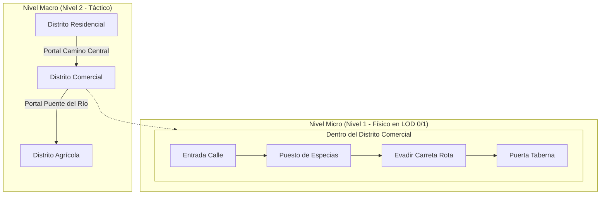

# 04. Inteligencia Espacial, Rutinas y Optimización de Rutas (TSP)

Este documento especifica cómo los NPCs perciben el mapa del juego, gestionan sus agendas diarias y resuelven la optimización de sus desplazamientos físicos y tareas dispersas mediante el **Problema del Viajante (TSP)** de manera ultraeficiente.

---

## 1. Representación del Mundo: El Grafo de Puntos de Interés (POI Graph)

Para evitar que los cálculos de navegación ahoguen la CPU, el mundo **no se consulta celda por celda ni polígono por polígono** en la toma de decisiones estratégicas.

El entorno se abstrae como un **Grafo Topológico de Puntos de Interés**:

$$\mathcal{G}_{\text{world}} = (\mathcal{V}_{\text{POI}}, \mathcal{E}_{\text{transit}})$$

```
[Granja Norte] ═══════ (Camino Real) ═══════ [Molino]
     ║                                          ║
     ║ (Sendero)                                ║ (Calle)
     ▼                                          ▼
[Mercado Central] ══════ (Plaza Mayor) ══════ [Taberna "El Jabalí"]
     ║                                          ║
     ║ (Callejón)                               ║ (Paso subterráneo)
     ▼                                          ▼
[Vivienda Mateo] ════════════════════════════ [Herrería Bruno]
```

### Componentes de un POI (Punto de Interés):
* **ID y Tipo:** `mercado_puesto_fruta`, `banco_parque`, `yunque_herrero`, `cama_propia`.
* **Capacidad de Concurrencia:** Número máximo de NPCs que pueden interactuar simultáneamente (ej. una cama = 1, la taberna = 20).
* **Affordances (Acciones permitidas):** `[DORMIR, COMER, TRABAJAR_HERRERIA, SOCIALIZAR, VENDER]`.
* **Costes de Tránsito Precalculados:** Matriz de distancias $D[i, j]$ entre POIs calculada en tiempo de compilación/carga del mapa.

---

## 2. Agenda Circadiana Flexible (Schedules)

Inspirado en *Stardew Valley* y *Red Dead Redemption 2*, cada profesión posee una plantilla horaria diaria con **ventanas de tolerancia**:

```
00:00        06:00       08:00           13:00   14:00           18:00           22:00       24:00
┌──────────────┬───────────┬───────────────┬───────┬───────────────┬───────────────┬───────────┐
│ Dormir en    │ Aseo y    │ Trabajo en    │ Almuerzo│ Comercio /    │ Ocio Social   │ Regreso y │
│ Cama Propia  │ Desayuno  │ Campo/Taller  │ Rápido│ Recados Varios│ en Taberna    │ Cena Casa │
└──────────────┴───────────┴───────────────┴───────┴───────────────┴───────────────┴───────────┘
```

### Flexibilidad Condicional (Interrupciones Orgánicas):
La agenda no es un carril férreo rígido. Si ocurre cualquiera de estas condiciones, la agenda se suspende mediante una **Pila de Estados (*Interruption Stack*)**:
1. **Necesidad Crítica:** Si $\text{Hambre} > 85$ a las 10:00 AM, el NPC interrumpe el trabajo y visita el almacén para comer.
2. **Clima Adverso:** Si llueve torrencialmente y el NPC no tiene ropa adecuada, abandona el campo y se refugia bajo un tejado.
3. **Interacción Social / Conversación:** Si el jugador o un amigo le habla, detiene su marcha y orienta su mirada. Al terminar, reanuda la tarea activa sin reiniciar el día.

---

## 3. Optimización de Tareas y Rutas mediante TSP (Traveling Salesperson Problem)

### El Escenario de las Tareas Dispersas
Un granjero o artesano no va simplemente de A a B. Su jornada laboral a menudo involucra una **lista no ordenada de recados ($N$ tareas)**:
* Recoger 3 sacos de trigo del campo A.
* Reparar la valla rota en el sector norte.
* Llevar el grano al molino.
* Comprar semillas nuevas en el mercado central.
* Llevar sobras al corral de animales.

Si el NPC visita los puntos en orden aleatorio, recorrerá distancias absurdas pareciendo errático y consumiendo tiempo innecesario.

```
Ruta Caótica (Ingenua):                    Ruta Optimizada (TSP 2-opt):
   [A] ───────────► [C]                       [A] ────────────► [B]
    │                ▲                         │                 │
    │  ╭───────────╯ │                         │                 │
    ▼  ▼             │                         ▼                 ▼
   [D] ───────────► [B]                       [D] ◄─────────── [C]
   (Cruces de camino y pérdida de tiempo)     (Circuito cerrado y natural)
```

### Algoritmo Ligero: Heurística 2-opt sobre Grafo de POIs

Dado que $N$ suele ser pequeño ($3 \le N \le 8$ tareas por franja horaria), no se requiere programación entera mixta ni fuerza bruta $O(N!)$.

Se aplica una combinación en dos fases que toma **menos de 0.02 milisegundos de CPU**:
1. **Fase 1: Vecino Más Cercano (*Greedy Nearest Neighbor*):**
   * Comenzando en la posición actual del NPC, selecciona iterativamente el POI no visitado más cercano usando la matriz de distancias precalculada $D[i, j]$.
2. **Fase 2: Optimización Local *2-opt*:**
   * Itera sobre los pares de aristas de la ruta; si cruzar dos conexiones reduce la distancia total sin violar restricciones de precedencia (ej. "cosechar antes de moler"), invierte el segmento.

$$\Delta_{\text{dist}} = (D[u, v'] + D[u', v]) - (D[u, u'] + D[v, v'])$$
Si $\Delta_{\text{dist}} < 0$, se adopta la nueva ruta.

---

## 4. Navegación Jerárquica: HPA\* (*Hierarchical Pathfinding*)

Para ejecutar físicamente los desplazamientos sin colapsar la malla de navegación (*NavMesh*):



1. **Ruta Macro (HPA\* en Grafo de Nodos/Portales):**
   * Resuelve el tránsito entre regiones completas del mapa en microsegundos.
   * Funciona incluso si el NPC está en **LOD 2 (fuera de pantalla)**.
2. **Ruta Micro (NavMesh A\* local):**
   * Solo se activa si el NPC está a menos de 100 metros del jugador (LOD 0 o LOD 1).
   * Calcula la trayectoria detallada con evitación de obstáculos dinámicos (otros peatones, carretas, barriles).

---

## 5. Pila de Reanudación de Comportamiento (*Behavior Resumption Stack*)

Cuando un evento interrumpe la rutina de un NPC, el estado se guarda en una pila LIFO (*Last-In, First-Out*):

```json
{
  "stack_size": 2,
  "stack": [
    {
      "estado": "RUTINA_TRABAJO_GRANJA",
      "progreso": "tarea_3_de_5",
      "poi_objetivo": "campo_trigo_norte",
      "datos_contexto": { "sacos_recogidos": 2 }
    },
    {
      "estado": "CONVERSACION_CON_JUGADOR",
      "interlocutor": "player_id",
      "tiempo_inicio": 842.1
    }
  ]
}
```

* Al despedirse el jugador, el estado `CONVERSACION_CON_JUGADOR` se extrae de la pila.
* El NPC regresa inmediatamente a `RUTINA_TRABAJO_GRANJA` con sus sacos ya recogidos intactos, retomando la navegación hacia su objetivo sin reinicios de ciclo artificiales.
