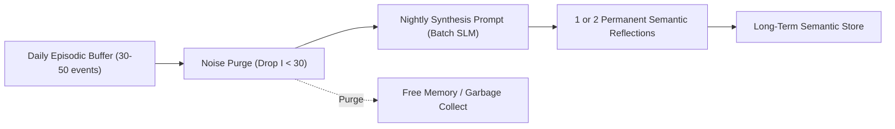

# 05. Memory and Cognitive Pipeline

This document details the storage architecture, retrieval scoring mechanics, and reflective consolidation pipeline of **SNA**. Its purpose is to endow NPCs with durable, cumulative personal histories without causing memory leaks or compromising language model latency.

---

## 1. The Three-Tier Memory Hierarchy

To mirror human memory retention while safeguarding compute resources, memory is divided into three tiers of persistence and abstraction:

```
┌────────────────────────────────────────────────────────────────────────┐
│                   TIER 1: IMMEDIATE SENSORY BUFFER                     │
│  * Storage: In-memory circular ring buffer (last 30 sensory events)    │
│  * Content: Raw sensory perceptions (< 2 minutes old)                  │
│  * Cost: Near-zero CPU / Nanoseconds                                   │
└───────────────────────────────────┬────────────────────────────────────┘
                                    │ Importance Filter (Threshold > 40)
┌───────────────────────────────────▼────────────────────────────────────┐
│                   TIER 2: DAILY EPISODIC MEMORY                        │
│  * Storage: In-memory SQLite table / Contiguous structs                │
│  * Content: Meaningful events occurring during the current day         │
│  * Cost: Microseconds                                                  │
└───────────────────────────────────┬────────────────────────────────────┘
                                    │ Nightly Consolidation (During Sleep)
┌───────────────────────────────────▼────────────────────────────────────┐
│                   TIER 3: SEMANTIC MEMORY & REFLECTIONS                │
│  * Storage: Lightweight vector store / SQLite with sqlite-vss / FTS5   │
│  * Content: Long-term beliefs, consolidated opinions, life lessons     │
│  * Cost: On-demand query (RAG < 5ms)                                   │
└────────────────────────────────────────────────────────────────────────┘
```

---

## 2. Anatomy of a Memory Record (*Memory Node*)

Every episodic and semantic memory record is stored with this compact structure:

```json
{
  "id": 1042,
  "timestamp": 12840.5,
  "type": "EPISODIC",
  "description": "The player drew a bloodied blade right outside my shop",
  "subject_involved": "player_id",
  "emotional_charge": -0.85,
  "intrinsic_importance": 90,
  "semantic_tags": ["danger", "crime", "player", "violence"],
  "embedding_vector": [0.124, -0.052, 0.441, "...", -0.219]
}
```

* **Intrinsic Importance ($[0, 100]$):** Assigned deterministically via contextual rules:
  * Mundane routine (e.g., "Ate breakfast stew"): $10$.
  * Positive social event (e.g., "Elena gifted rare wild flowers"): $60$.
  * Threatening or violent encounter (e.g., "Witnessed armed robbery"): $95$.

---

## 3. Retrieval Scoring Function

When an NPC engages in dialogue or resolves a critical decision in situation $q$, the full memory ledger is never dumped into context. A weighted retrieval function inspired by Stanford's generative agents research is evaluated:

$$\text{Score}(m, q) = w_r \cdot \text{Recency}(m) + w_i \cdot \text{Importance}(m) + w_s \cdot \text{Relevance}(m, q)$$

### Scoring Components:
1. **Recency:** Exponential decay over game time since occurrence:
   $$\text{Recency}(m) = e^{-\lambda \cdot (t_{\text{current}} - t_m)}$$
   * $\lambda$: Forgetting decay rate ($0.995$ per in-game hour).
2. **Importance:** Normalized intrinsic weight:
   $$\text{Importance}(m) = \frac{\text{intrinsic\_importance}}{100}$$
3. **Semantic Relevance:** Cosine similarity between query situation embedding and memory vector:
   $$\text{Relevance}(m, q) = \frac{\mathbf{v}_m \cdot \mathbf{v}_q}{\|\mathbf{v}_m\| \|\mathbf{v}_q\|}$$

> [!TIP]
> **Embedding-Free Optimization for Modest Hardware:**  
> When operating on low-power devices without neural accelerators, cosine similarity is substituted with **weighted BM25 keyword matching** over SQLite FTS5, cutting retrieval execution to under **0.5 milliseconds**.

---

## 4. Nightly Consolidation: The Sleep and Reflection Phase

Unchecked conversational agents degrade as their memory tables balloon with trivial records. To combat bloat, SNA implements **biological sleep consolidation**:



### Consolidation Workflow:
1. **Noise Purging:** At 02:00 AM game time (while the agent sleeps), low-salience records ($\text{Importance} < 30$) are purged from the daily buffer.
2. **Batch Synthesis:** The remaining salient events are bundled and dispatched to the local SLM in a single background batch query:
   * *Input Context:*
     * "Thomas said he saw Elena and Bruno together in the woods."
     * "Elena arrived home late and declined supper."
     * "Bruno avoided eye contact outside his forge."
   * *SLM Generated Output:*
     * *"Reflection: I can no longer trust Elena. I suspect she and Bruno are hiding an affair. I must monitor her whereabouts."*
3. **Permanent Retention:** The synthetic reflection is committed to the long-term semantic table as an immutable **Belief/Opinion**. Atomic day logs are cleared, keeping storage overhead minimal and constant over in-game years.

---

## 5. Dynamic Prompt Assembly Pipeline

To guarantee sub-second responses with 1B to 3B models, prompts are dynamically assembled from compact modular slots, strictly bounding total context to under **300 tokens**:

```
┌─────────────────────────────────────────────────────────────┐
│ 1. IDENTITY & LORE ANCHORS (Fixed System Prompt)            │
│    "You are Matthew, 35, tavernkeeper. Proud, suspicious"   │
├─────────────────────────────────────────────────────────────┤
│ 2. BIOLOGICAL & EMOTIONAL STATE (Simulation Variables)      │
│    "Stress: 75/100 (High). Mood: Enraged and insecure"      │
├─────────────────────────────────────────────────────────────┤
│ 3. RELATIONAL CONTEXT (Sliced from Social Graph)            │
│    "Interlocutor: Elena (Wife). Trust: 10/100"              │
├─────────────────────────────────────────────────────────────┤
│ 4. TOP 3 RETRIEVED MEMORIES (Sorted by Retrieval Score)     │
│    - "You suspect Elena is cheating with Bruno (Yesterday)" │
│    - "You spotted Bruno loitering outside last night"       │
├─────────────────────────────────────────────────────────────┤
│ 5. OUTPUT CONSTRAINTS (Strict Schema Specification)         │
│    "Return JSON: max 2 spoken lines + state transition"     │
└─────────────────────────────────────────────────────────────┘
```

### Mandatory Output Schema:
The model emits structured JSON exclusively, enabling the game engine to execute logic without fragile natural language parsing:

```json
{
  "dialogue": "You're late, Elena... Or did the forge bellows need an extra pair of hands to stoke the flame?",
  "visual_emotion": "bitter_sarcasm",
  "relationship_delta": {
    "trust": -5,
    "affinity": -2
  },
  "next_action": "turn_away_and_clean_glasses"
}
```
