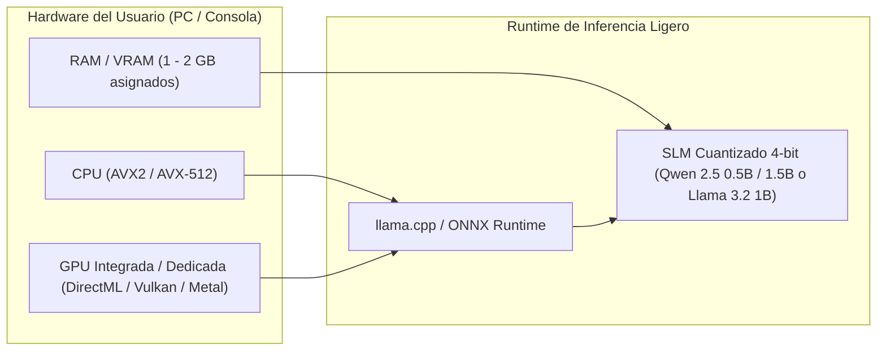

# 06. Rendimiento, LOD Conductual y Ejecución en Hardware

Este documento describe la estrategia de optimización para permitir la simulación concurrente de **cientos o miles de NPCs inteligentes** en hardware de consumo contemporáneo (PCs de gama media, consolas y portátiles) sin comprometer la fluidez de fotogramas (60 FPS estables) ni saturar la memoria RAM o VRAM.

---

## 1. El Concepto de LOD Conductual (*Behavioral Level of Detail*)

De la misma forma que un motor gráfico reduce los polígonos de una malla 3D cuando un objeto se aleja de la cámara, **SNA reduce la fidelidad matemática y cognitiva de los NPCs según su relevancia para el jugador**:

```
                       [CÁMARA DEL JUGADOR]
                                │
    < 20 metros                 ▼                   LOD 0: Alta Fidelidad
 ┌────────────────────────────────────────────────────────────────────────┐
 │ * Modelo 3D completo, IK, animaciones faciales y sincronización labial │
 │ * Inferencia SLM en tiempo real para diálogos dinámicos                │
 │ * Sensores visuales/auditivos continuos (30-60 FPS)                    │
 └────────────────────────────────────────────────────────────────────────┘
                                │
    20 - 100 metros             ▼                   LOD 1: Fidelidad Media
 ┌────────────────────────────────────────────────────────────────────────┐
 │ * Animaciones simplificadas, sin IK facial ni sincronización labial    │
 │ * Sin LLM: Diálogos mediante "Barks" arquetípicos y bancos de frases   │
 │ * Utility AI y navegación NavMesh estándar (1 - 2 FPS / ticks)         │
 └────────────────────────────────────────────────────────────────────────┘
                                │
    > 100 metros (Fuera de vista) ▼                 LOD 2: Simulación Abstracta
 ┌────────────────────────────────────────────────────────────────────────┐
 │ * Sin entidades 3D, sin física, sin mallas de colisión                 │
 │ * Movimiento puramente matemático interpolado sobre el grafo de POIs   │
 │ * Ticks discretos cada 30-60 segundos (evaluación estadística de datos)│
 └────────────────────────────────────────────────────────────────────────┘
```

### Tabla Comparativa de Recursos por Nivel de Detalle:

| Nivel de Detalle | Población Típica | Consumo de CPU por NPC | Uso de Memoria por NPC | Inferencia SLM |
| :--- | :---: | :---: | :---: | :---: |
| **LOD 0** | 3 – 8 NPCs | $\approx 0.15\text{ ms}$ | $50\text{ KB}$ (RAM) + Malla 3D | Activa (Prioridad Máxima) |
| **LOD 1** | 20 – 50 NPCs | $\approx 0.02\text{ ms}$ | $20\text{ KB}$ (RAM) | Desactivada (Salvo eventos excepcionales) |
| **LOD 2** | 300 – 1.000+ NPCs | $\approx 0.001\text{ ms}$ | $2\text{ KB}$ (Solo structs numéricos) | Totalmente Desactivada |

---

## 2. Presupuesto de CPU para un Poblado de 500 NPCs

Gracias al Behavioral LOD, el coste total de simulación en CPU por cada fotograma (a 60 FPS, donde el marco total disponible es de $16.6\text{ ms}$) es insignificante:

$$\text{Tiempo Total de IA} = (5 \times 0.15\text{ ms}) + (35 \times 0.02\text{ ms}) + (460 \times 0.001\text{ ms}) \approx 0.75 + 0.70 + 0.46 = \mathbf{1.91\text{ ms}}$$

> [!NOTE]
> Menos de **$2.0\text{ ms}$ de tiempo de CPU** para gobernar un ecosistema vivo de 500 habitantes, dejando más del 85% del tiempo de procesador libre para física, renderizado, sonido y lógica del jugador.

---

## 3. Estrategia de Inferencia Local: Modelos SLM Cuantizados

Para evitar la dependencia de conexiones a Internet, servidores en la nube y costes recurrentes por token, **SNA está diseñado para modelos pequeños locales (*Small Language Models*)**:



### Modelos de Referencia Recomendados:
1. **Qwen 2.5 (0.5B - 1.5B Instruct en Q4_K_M):**
   * Huella en memoria: **$350\text{ MB} - 950\text{ MB}$ de RAM/VRAM**.
   * Velocidad: Más de **$60 - 120\text{ tokens/segundo}$** en hardware moderno mediante aceleración DirectML / ONNX o CPU.
   * Capacidad: Excelente seguimiento de formatos estructurados JSON y diálogos breves con fuerte personalidad.
2. **Llama 3.2 (1B - 3B Instruct en Q4_K_M):**
   * Huella en memoria: **$750\text{ MB} - 1.8\text{ GB}$**.
   * Capacidad: Riqueza léxica superior, ideal para NPCs clave de misiones principales o debates filosóficos.

---

## 4. Planificador de Inferencia con Ventana de Tiempo (*Time-Slicing Scheduler*)

Para que la inferencia del modelo de lenguaje nunca congele el motor:
* **Inferencia Mono-Hilo / Lote Reducido:** Solo se ejecuta **una inferencia a la vez** (o en pequeños batches de 2) en un hilo secundario independiente de la simulación del juego.
* **Cola de Prioridades con Asignación de Tokens:**

```
[Solicitudes Entrantes]
   │
   ├── [Prioridad 1] Jugador hablando cara a cara con NPC A ───────► Se procesa INMEDIATAMENTE
   ├── [Prioridad 2] Dos NPCs interactuando en LOD 0 (visible) ────► Se procesa al terminar P1
   └── [Prioridad 3] Síntesis de recuerdos nocturnos (sueño) ───────► Se procesa en tiempos muertos
```

* **Presupuesto Máximo de Tokens:**
  * Diálogos en tiempo real: Máximo **40 tokens de salida** (aproximadamente 2 frases directas, generadas en $\approx 250 - 400\text{ ms}$).
  * Mientras el SLM genera la frase, el NPC en LOD 0 reproduce una animación de escucha, asiente con la cabeza o balbucea un conector de voz breve ("Déjame ver...", "Bueno..."), eliminando cualquier percepción de lag para el jugador.

---

## 5. Estructura de Datos Orientada a Memoria Contigua (ECS)

Para los 500 NPCs en LOD 1 y LOD 2, los datos se almacenan en arrays contiguos (*Structure of Arrays*):

```rust
// Ejemplo en Rust / C++ conceptual
struct NPCPopulationData {
    ids: Vec<u32>,
    positions: Vec<Vector2>,          // Coordenadas topológicas
    current_poi_target: Vec<u16>,     // Índice del POI hacia donde va
    needs_hunger: Vec<u8>,            // 0 a 100
    needs_energy: Vec<u8>,            // 0 a 100
    needs_social: Vec<u8>,            // 0 a 100
    stress_level: Vec<u8>,            // 0 a 100
    pad_pleasure: Vec<i8>,            // -100 a +100
    pad_arousal: Vec<i8>,             // -100 a +100
    pad_dominance: Vec<i8>,           // -100 a +100
    active_lod: Vec<u8>,              // 0, 1 o 2
}
```

* **Beneficio de Caché L1/L2:** Iterar sobre el vector de necesidades de 500 NPCs para aplicar el decaimiento por segundo toma **menos de 3 microsegundos** ($0.003\text{ ms}$), ya que los datos están compactados y no requieren saltos de punteros por el montón (*heap*).

---

## 6. Conclusión Técnica de Viabilidad

El mito de que los NPCs con inteligencia artificial generativa requieren supercomputadores en la nube o hacen colapsar los ordenadores se desmonta con **SNA**:
1. **La simulación pesada es matemática pura en CPU (ECS + Utility AI).**
2. **El modelo de lenguaje solo se despierta cuando hay algo que decir o consolidar.**
3. **El Behavioral LOD apaga el 90% del coste de cómputo para los personajes que el jugador no tiene en su campo visual inmediato.**
