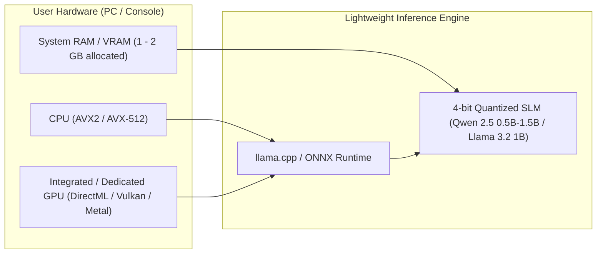

# 06. Hardware, Performance, and Behavioral LOD

This document describes the optimization architecture enabling concurrent simulation of **hundreds to thousands of intelligent NPCs** on consumer hardware (mid-tier gaming PCs, modern consoles, and APU laptops) while maintaining locked 60 FPS performance without memory saturation.

---

## 1. The Concept of Behavioral Level of Detail (Behavioral LOD)

Just as rendering pipelines downgrade polygon counts as geometry recedes from the viewport, **SNA scales the mathematical and cognitive fidelity of NPCs based on player proximity and relevance**:

```
                       [PLAYER VIEWPORT]
                                │
    < 20 meters                 ▼                   LOD 0: High Fidelity
 ┌────────────────────────────────────────────────────────────────────────┐
 │ * Full 3D model, inverse kinematics (IK), facial blendshapes, lip-sync │
 │ * Real-time SLM inference for generative dynamic dialogue              │
 │ * Continuous vision/hearing perception updates (30-60 FPS)             │
 └────────────────────────────────────────────────────────────────────────┘
                                │
    20 - 100 meters             ▼                   LOD 1: Medium Fidelity
 ┌────────────────────────────────────────────────────────────────────────┐
 │ * Simplified skeletal animation; facial IK disabled                    │
 │ * No LLM: Interactions use archetypal barks & pre-authored voice banks │
 │ * Standard Utility AI and coarse NavMesh navigation (1 - 2 FPS ticks)  │
 └────────────────────────────────────────────────────────────────────────┘
                                │
    > 100 meters (Off-screen)   ▼                   LOD 2: Abstract Simulation
 ┌────────────────────────────────────────────────────────────────────────┐
 │ * No 3D meshes, no skeletal physics, no spatial collision meshes       │
 │ * Purely algebraic transit interpolated across the POI graph           │
 │ * Discrete coarse ticks every 30 - 60 seconds (statistical evaluation) │
 └────────────────────────────────────────────────────────────────────────┘
```

### Resource Allocation Across Detail Tiers:

| Detail Tier | Typical Population | CPU Time per NPC | Memory Footprint per NPC | SLM Inference |
| :--- | :---: | :---: | :---: | :---: |
| **LOD 0** | 3 – 8 NPCs | $\approx 0.15\text{ ms}$ | $50\text{ KB}$ (RAM) + 3D Asset | Active (Top Priority) |
| **LOD 1** | 20 – 50 NPCs | $\approx 0.02\text{ ms}$ | $20\text{ KB}$ (RAM) | Disabled (Except scripted alerts) |
| **LOD 2** | 300 – 1,000+ NPCs | $\approx 0.001\text{ ms}$ | $2\text{ KB}$ (Numeric structs only) | Fully Deactivated |

---

## 2. CPU Frame Budget for a 500-NPC Town

By virtue of Behavioral LOD, the cumulative per-frame CPU load (at 60 FPS, with a full frame budget of $16.6\text{ ms}$) remains negligible:

$$\text{Total AI Budget} = (5 \times 0.15\text{ ms}) + (35 \times 0.02\text{ ms}) + (460 \times 0.001\text{ ms}) \approx 0.75 + 0.70 + 0.46 = \mathbf{1.91\text{ ms}}$$

> [!NOTE]
> Under **$2.0\text{ ms}$ of total CPU time** simulates a thriving settlement of 500 autonomous denizens, leaving over 85% of the frame available for graphics, physics, audio, and gameplay logic.

---

## 3. Local Inference Strategy: Quantized SLMs

To eliminate cloud server expenses, privacy concerns, and offline disconnects, **SNA is engineered specifically for local Small Language Models**:



### Recommended Reference Models:
1. **Qwen 2.5 (0.5B – 1.5B Instruct in Q4_K_M):**
   * Memory Footprint: **$350\text{ MB} - 950\text{ MB}$ RAM/VRAM**.
   * Generation Speed: **$60 - 120\text{ tokens/second}$** on modern consumer APUs/GPUs via DirectML, ONNX, or Vulkan.
   * Strengths: Exceptional adherence to structured JSON schemas and strong personality modulation in concise replies.
2. **Llama 3.2 (1B – 3B Instruct in Q4_K_M):**
   * Memory Footprint: **$750\text{ MB} - 1.8\text{ GB}$**.
   * Strengths: Broad vocabulary and nuanced subtext, suited for quest-critical NPCs and complex dilemmas.

---

## 4. Time-Slicing Inference Scheduler

To preserve rock-solid frametimes during text generation:
* **Single-Worker Serialized Queue:** Only **one active inference task** executes at any given moment (or micro-batches of 2) on a detached background worker.
* **Prioritized Token Dispatch:**

```
[Incoming Inference Requests]
   │
   ├── [Priority 1] Player in direct face-to-face dialogue ──► Dispatched IMMEDIATELY
   ├── [Priority 2] Two visible NPCs conversing in LOD 0 ────► Dispatched after P1 completes
   └── [Priority 3] Nightly sleep memory consolidation ──────► Dispatched during idle periods
```

* **Constrained Output Budget:**
  * Interactive Dialogue: Strictly capped at **40 generated tokens** ($\approx 2$ punchy sentences, completed in $250 - 400\text{ ms}$).
  * Latency Masking: While the SLM streams tokens, the LOD 0 character plays an attentive nod, turns their head, or utters a brief natural audio grunt ("Well...", "Let me see..."), rendering inference delay imperceptible.

---

## 5. Contiguous Memory Architecture (ECS)

For hundreds of agents in LOD 1 and LOD 2, state variables are laid out contiguously in memory using a Structure of Arrays (SoA):

```rust
// Conceptual Rust / C++ layout
struct NPCPopulationData {
    ids: Vec<u32>,
    positions: Vec<Vector2>,          // Topological coordinates
    current_poi_target: Vec<u16>,     // Target POI index
    needs_hunger: Vec<u8>,            // 0 to 100
    needs_energy: Vec<u8>,            // 0 to 100
    needs_social: Vec<u8>,            // 0 to 100
    stress_level: Vec<u8>,            // 0 to 100
    pad_pleasure: Vec<i8>,            // -100 to +100
    pad_arousal: Vec<i8>,             // -100 to +100
    pad_dominance: Vec<i8>,           // -100 to +100
    active_lod: Vec<u8>,              // 0, 1, or 2
}
```

* **Cache Locality:** Iterating through 500 agents to apply per-second decay rates completes in **under 3 microseconds** ($0.003\text{ ms}$), leveraging hardware prefetching and zero heap pointer chasing.

---

## 6. Technical Viability Takeaways

The notion that generative AI NPCs require server farms or cause gaming hardware to melt is addressed directly by **SNA**:
1. **Continuous simulation is pure CPU arithmetic (ECS + Utility AI).**
2. **Language models activate only when there is something meaningful to say or consolidate.**
3. **Behavioral LOD discards 90% of processing overhead for entities outside the player's immediate focus.**
