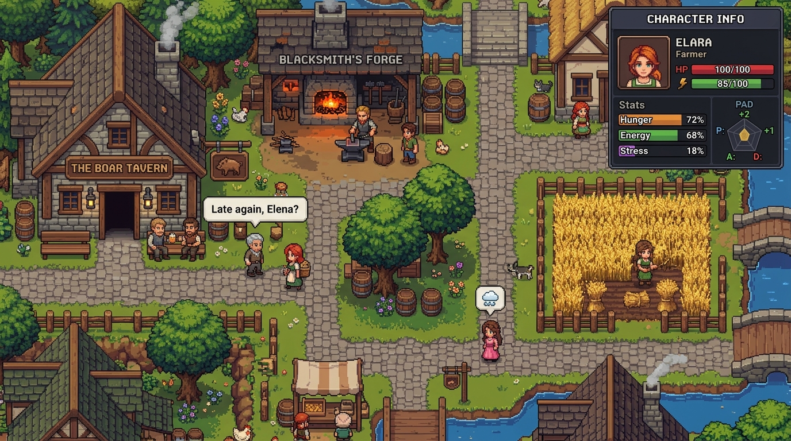

# 07. Implementation Plan: 2D "Minimum Viable Village" Prototype (MVP)

This document establishes the practical roadmap for constructing a playable 2D proof-of-concept validating **SNA**. The goal is not an immediate commercial product, but an **interactive laboratory for emergent life simulation** featuring 5 autonomous characters in a bounded environment.

---

## 1. Scope and Scenario of the Minimal Village

### Physical Layout (2D 32x24 Grid Tilemap)
A compact rural settlement featuring 4 functional Points of Interest (POIs):

```
┌────────────────────────────────────────────────────────────────────────┐
│                        2D MAP: RIVER VILLAGE                           │
│                                                                        │
│   [Wheat Farm] 🌾                            [Bruno's Forge] ⚒️       │
│   (3 harvesting plots)                       (Anvil, furnace, coal)    │
│                                                                        │
│                 ═════════════[Central Road]═════════════               │
│                                                                        │
│   [Shared House] 🛏️                          [The Boar Tavern] 🍺     │
│   (Beds for nighttime rest)                  (Tables, bar counter)     │
│                                                                        │
└────────────────────────────────────────────────────────────────────────┘
```

<p align="center">
  
  <br>
  <em><b>Visual Concept Mockup:</b> Target aesthetic for the 2D prototype illustrating the village layout, overhead generative dialogue barks, and real-time telemetry inspector (conceptual illustration, not an in-engine screenshot).</em>
</p>

### The 5 Experimental Inhabitants:
1. **Matthew (The Tavernkeeper):** Married to Elena. Traits: *Spiteful, Jealous*. Runs the tavern during evenings; sleeps at the shared home.
2. **Elena (The Healer / Herbalist):** Married to Matthew. Traits: *Sociable, Empathetic*. Gathers herbs by day; visits the tavern at dusk.
3. **Bruno (The Blacksmith):** Single. Traits: *Solitary, Passionate*. Harbors secret, unreciprocated romantic feelings toward Elena.
4. **Thomas (The Farmer):** Single. Traits: *Gossip, Outgoing*. Tends the wheat farm; eagerly shares observations over drinks at the tavern.
5. **Clara (The Merchant):** Traits: *Materialistic, Observant*. Purchases wheat from Thomas and tools from Bruno to trade general goods.

### The "Emergent Turing Test" (The Drama Benchmark):
The prototype is considered an unequivocal success if, without any hardcoded scripting:
1. Thomas witnesses Elena and Bruno conversing near the blacksmith's forge.
2. Thomas mentions this encounter to Matthew while ordering an ale at the tavern counter.
3. Matthew's social graph automatically updates: trust in Elena falls, hatred toward Bruno spikes.
4. When Elena later enters the tavern, Matthew confronts her with a contextually coherent, sarcastic remark generated on the spot by the local SLM.

---

## 2. Recommended Tech Stack for Rapid Prototyping

To iterate rapidly with minimal compilation friction:

| Layer | Technology Choice | Rationale |
| :--- | :--- | :--- |
| **Base Language** | **Python 3.11+** | Rapid prototyping speed, clean data handling, top-tier AI/LLM ecosystem. |
| **2D Engine / Rendering** | **Pygame-CE** or **Arcade** | Direct 2D rendering, simple sprites, rock-solid 60 FPS event loop. |
| **Simulation & State** | **Lightweight ECS (esper / custom) + SQLite** | Data-oriented design for biological drives; ACID persistence for memories. |
| **SLM Inference Engine** | **`llama-cpp-python` / Local Ollama** | Hardware-accelerated local execution of **Qwen 2.5 0.5B / 1.5B (GGUF 4-bit)**. |
| **Navigation** | **Grid $A^*$ + 2-opt TSP** | Fast, deterministic grid pathfinding and optimal errand sequence solving. |

---

## 3. Phase Breakdown, Tasks, and Time Estimates

Below is an engineering comparison of estimated development time between **Traditional Solo Development** and **AI-Assisted Development (via Antigravity)**.

### PHASE 1: The Board & Physical Loop (The Body)
*Construction of the 2D tilemap, 60 FPS update loop, and character locomotion.*

| Task | Technical Description | Traditional Dev | AI-Assisted |
| :--- | :--- | :---: | :---: |
| **1.1 Environment & Tilemap** | 2D tile renderer (grass, cobblestones, POI structural walls). | 6 hours | 1.5 hours |
| **1.2 ECS Needs Components** | Structs for Hunger, Energy, and Fun with continuous decay and utility curves. | 8 hours | 2.0 hours |
| **1.3 $A^*$ Pathfinding & Routines** | Grid navigation enabling transit between POIs based on schedule time. | 10 hours | 2.5 hours |
| **1.4 2-opt TSP Optimizer** | Heuristic sequencer for ordering 3-4 daily errands along the shortest route. | 6 hours | 1.5 hours |
| **Phase 1 Subtotal** | | **30 hours** | **7.5 hours** |

---

### PHASE 2: The Social Graph & Senses (The Relationships)
*Sensory perception mechanics and relational graph updates.*

| Task | Technical Description | Traditional Dev | AI-Assisted |
| :--- | :--- | :---: | :---: |
| **2.1 Vision & Proximity Sensors** | Spatial cones detecting which agents and objects enter an NPC's line of sight. | 6 hours | 1.5 hours |
| **2.2 Social Graph Representation** | In-memory directed adjacency matrix: Affinity, Trust, and Romance for all 5 NPCs. | 8 hours | 2.0 hours |
| **2.3 Gossip Engine** | Information exchange packets between co-located NPCs with emotional distortion. | 12 hours | 3.0 hours |
| **2.4 Mood & Crisis Triggers** | State triggers altering PAD vectors and firing interrupts (e.g., eye contact confrontations).| 8 hours | 2.0 hours |
| **Phase 2 Subtotal** | | **34 hours** | **8.5 hours** |

---

### PHASE 3: The Voice & Mind (Local SLM Integration)
*Asynchronous bridge connecting the local language model for speech and thoughts.*

| Task | Technical Description | Traditional Dev | AI-Assisted |
| :--- | :--- | :---: | :---: |
| **3.1 Background Inference Worker** | Thread-safe queue preventing SLM execution from stalling Pygame's 60 FPS loop. | 10 hours | 2.5 hours |
| **3.2 Context-Aware Prompt Builder** | Dynamic prompt assembler (OCEAN + needs + relationship + last memory in < 250 tokens).| 8 hours | 2.0 hours |
| **3.3 JSON Output Schema Validator** | Strict parser ensuring valid output format (speech line, mood delta) without crashes. | 6 hours | 1.5 hours |
| **3.4 In-Game Speech Bubbles** | Floating pop-up text rendering above character sprites during dialogues. | 6 hours | 1.5 hours |
| **Phase 3 Subtotal** | | **30 hours** | **7.5 hours** |

---

### PHASE 4: Memory and the Day/Night Cycle
*Episodic persistence, sleeping, and reflective consolidation.*

| Task | Technical Description | Traditional Dev | AI-Assisted |
| :--- | :--- | :---: | :---: |
| **4.1 Episodic Memory Buffer** | In-memory SQLite table logging salient daily events witnessed by each character. | 8 hours | 2.0 hours |
| **4.2 Day/Night Cycle & Clock** | Visual clock, ambient light shifting, and bedtime curfew broadcast. | 4 hours | 1.0 hour |
| **4.3 Nightly Sleep Consolidation** | Batch SLM synthesis summarizing daily episodic logs into lasting opinions. | 10 hours | 2.5 hours |
| **Phase 4 Subtotal** | | **22 hours** | **5.5 hours** |

---

### PHASE 5: Telemetry & Inspection Panel (The "Mind Inspector")
*Visual debugging tooling allowing developers and players to inspect internal AI states.*

| Task | Technical Description | Traditional Dev | AI-Assisted |
| :--- | :--- | :---: | :---: |
| **5.1 Mouse Selection UI** | Click-to-inspect interaction opening an agent's telemetry sidebar. | 4 hours | 1.0 hour |
| **5.2 Needs & Mood Visualizer** | Real-time bars for Hunger, Energy, Stress, and coordinate in PAD space. | 4 hours | 1.0 hour |
| **5.3 Social Graph & Memory View** | Inspector displaying relational metrics toward other NPCs and top 3 memories. | 6 hours | 1.5 hours |
| **Phase 5 Subtotal** | | **14 hours** | **3.5 hours** |

---

## 4. Overall Development Effort Summary

```
┌────────────────────────────────────────────────────────────────────────┐
│ TOTAL PROJECT ESTIMATION (2D MVP VILLAGE):                             │
│                                                                        │
│ • Traditional Solo Development: 130 hours (~3.5 to 4 weeks)            │
│ • AI-Assisted Development:       32.5 hours (~4 to 5 working days)     │
│                                                                        │
│ ESTIMATED TIME SAVINGS: ~75% reduction in total development effort     │
└────────────────────────────────────────────────────────────────────────┘
```

> [!TIP]
> **Iterative Milestone Strategy:**  
> A functional **Milestone 0 (Phases 1 & 2 baseline)** can be running within **10-12 hours of assisted development**. Characters will navigate, sleep, eat, and express frustration using overhead emoji icons—proving out the simulation before connecting the language model.

---

## 5. Projected Codebase Architecture

When ready for code implementation, the project will be organized as follows:

```
sentient-npc-architecture/
├── docs/                             # Architectural design documents
│   └── 07-mvp-village-implementation-plan.md
├── src/
│   ├── core/
│   │   ├── ecs.py                    # Entity and component registry
│   │   ├── time_manager.py           # Game clock & circadian day/night phases
│   │   └── event_bus.py              # Central event publication bus
│   ├── simulation/
│   │   ├── needs.py                  # Physiological drive decay & utility curves
│   │   ├── navigation.py             # A* pathfinding and 2-opt TSP
│   │   └── social_graph.py           # Asymmetric graph & rumor dissemination
│   ├── ai/
│   │   ├── slm_worker.py             # Asynchronous inference thread (llama.cpp)
│   │   ├── prompt_builder.py         # Dynamic context assembler
│   │   └── memory_db.py              # SQLite storage & sleep reflection pipeline
│   ├── view/
│   │   ├── renderer.py               # 2D tilemap and character sprite rendering
│   │   └── ui_inspector.py           # Real-time telemetry inspector overlay
│   └── main.py                       # Application bootstrap
└── requirements.txt                  # Dependencies (pygame-ce, llama-cpp-python)
```
